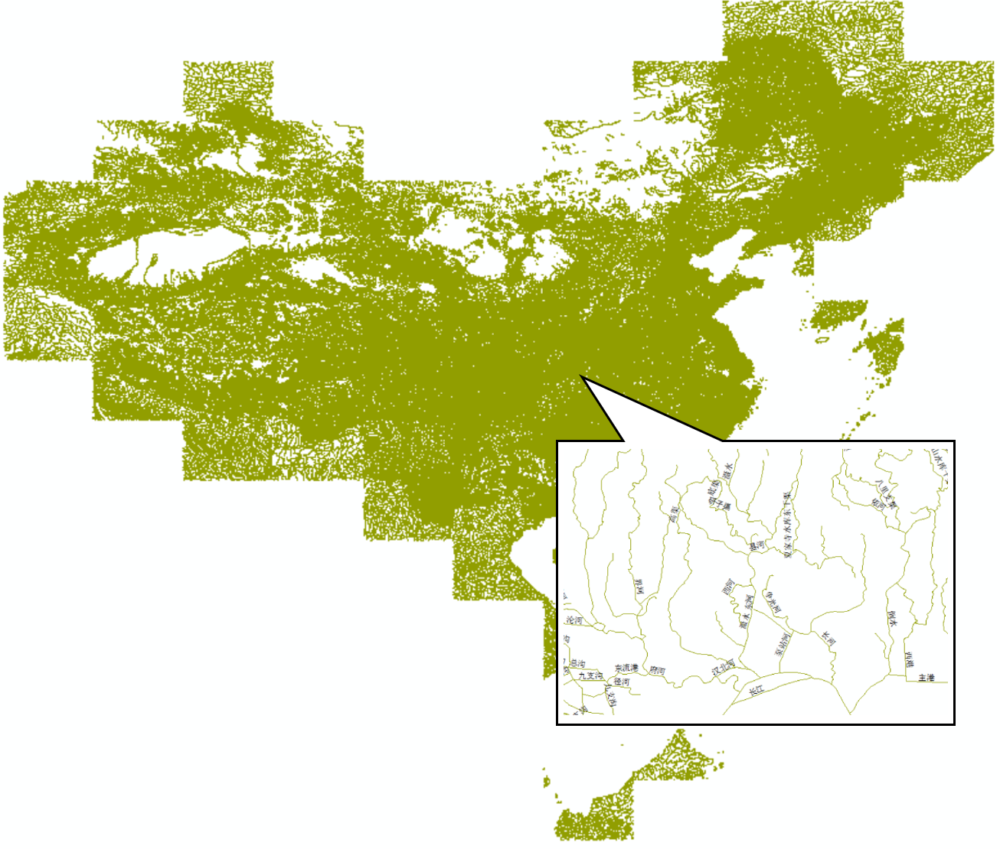
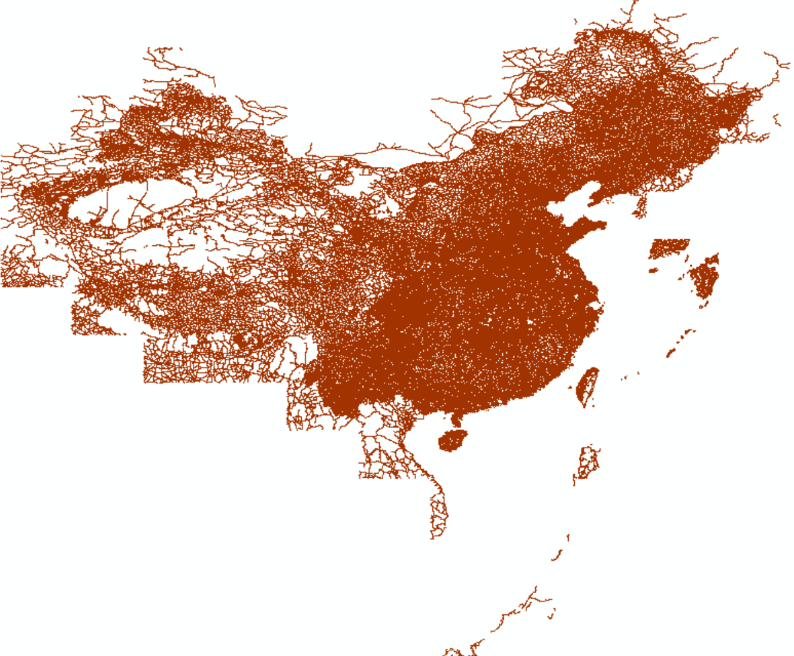

# 2017版1:100万全国标准基础地理数据！你值得拥有

本文介绍国家标准地理数据的获取以及处理为GMT支持格式的方法，具体包括：
  * 国家标准1:100万（非涉密）基础地理数据的申请、下载
  * 数据集内容简介
  * 数据集要素合并、提取
  * 借助OGR工具将SHP转为GMT可用格式

## 数据概况
国家基础地理信息中心于17年11月份开始免费向公众提供全国1:100万非涉密的全国基础地理数据库。该数据库共77幅DLG数据集，包括全国陆地范围以及台湾岛、海南岛、钓鱼岛、南海诸岛在内的主要岛屿及其临近海域。目前数据整体现势性为2017年。

该数据库包括水系、居民地及设施、公路铁路、行政边界、地名等5个数据集12个数据层，如下图所示。数据更多介绍可访问[全国地理信息资源目录服务系统](http://www.webmap.cn/commres.do?method=result100W)。

  

## 数据获取
* 进入[全国地理信息资源目录服务系统](http://www.webmap.cn)，点右上角“注册”。已注册用户直接登陆。
* 在“数据下载”栏目中，点击进入“1：100万全国基础地理信息数据库”。
* 该数据集下有77个图幅产品，当前最新生产时间是2017年。可选择一两个图幅，或全部选中，加入成果车。
* 结算，填写订单中的个人信息，**验证手机号**，下载数据。  **注：**若未提示验证手机，换个firefox浏览器试试。

## 数据集内容简介
该数据集包括5类12个要素层，分别为：

* **AANP 自然地名（点）图层**：包括交通要素名、纪念地和古迹名、山名、水系名、海洋地域名、自然地域名等

  

* **AGNP 居民地（点）图层**：包括各级行政地名和城乡居民地名称等

  

  该数据集包括首都、省会、直辖市、特别行政区、地级行政区、县级行政区以及乡镇，以识别码CLASS进行区分：

  <table style="margin-left: 20px">  
    <tr>
      <th bgcolor='lightgray'> 行政区地名 </th>   
      <th bgcolor='lightgray'> CLASS码</th>
    </tr>
    <tr>  
      <td> 省行政地名（直辖市、自治区、特别行政区）</td>
      <td align= "center"> AB </td>
    </tr>
    <tr>  
      <td> 自治州、盟、地区行政地名</td>
      <td align= "center"> AC </td>
    </tr>
    <tr>  
      <td> 地级市行政地名</td>
      <td align= "center"> AD </td>
    </tr>
    <tr>  
      <td> 县级市行政地名</td>
      <td align= "center"> AE </td>
    </tr>
    <tr>  
      <td> 县级行政地名（自治县、旗、自治旗、地级市市辖区）</td>
      <td align= "center"> AF </td>
    </tr>
    <tr>  
      <td> 县辖区及县级行政区域的派出机构地名</td>
      <td align= "center"> AG </td>
    </tr>
    <tr>  
      <td> 街道办事处地名</td>
      <td align= "center"> AH </td>
    </tr>
    <tr>  
      <td> 镇行政地名</td>
      <td align= "center"> AI </td>
    </tr>
    <tr>  
      <td> 乡行政地名</td>
      <td align= "center"> AJ </td>
    </tr>
  </table>

* **BOUA 各级行政区（面）图层**

  

  注：该数据集包含了分幅边界，进行单个行政区（例如某省、市）边界、面积提取时需先合并图层。

* **BOUL 中国及邻区各级行政界限（线）图层**

  

  该数据集包括各级行政区界线，以GB码进行区分：

  <table style="margin-left: 20px">  
    <tr>
      <th bgcolor='lightgray'> 行政区界类型 </th>   
      <th bgcolor='lightgray'> GB码</th>
    </tr>
    <tr>  
      <td> 海岸线</td>
      <td align= "center"> 250200 </td>
    </tr>
    <tr>  
      <td> 水系交汇处</td>
      <td align= "center"> 260100 </td>
    </tr>
    <tr>  
      <td> 外国地区国界线</td>
      <td align= "center"> 610200 </td>
    </tr>
    <tr>  
      <td> 国界线（已定）</td>
      <td align= "center"> 620201 </td>
    </tr>
    <tr>  
      <td> 国界线（未定）</td>
      <td align= "center"> 620202 </td>
    </tr>
    <tr>  
      <td> 省级界线</td>
      <td align= "center"> 630200 </td>
    </tr>
    <tr>  
      <td> 特别行政区界</td>
      <td align= "center"> 630400 </td>
    </tr>
    <tr>  
      <td> 地、市、州级行政区界</td>
      <td align= "center"> 640200 </td>
    </tr>
    <tr>  
      <td> 县级行政区界（已定）</td>
      <td align= "center">650201 </td>
    </tr>
    <tr>  
      <td> 特殊地区界限</td>
      <td align= "center"> 670202 </td>
    </tr>
  </table>

* **BOUP 领海基点(点)图层**
* **HYDA 水系（面）图层，包括湖泊、水库、双线河流等**

  

  水系数据集以GB码区分：

  <table style="margin-left: 20px">  
    <tr>
      <th bgcolor='lightgray'> 水系要素类型 </th>   
      <th bgcolor='lightgray'> GB码</th>
    </tr>
    <tr>  
      <td> 地面河流</td>
      <td align= "center"> 210101 </td>
    </tr>
    <tr>  
      <td> 时令河</td>
      <td align= "center"> 210200 </td>
    </tr>
    <tr>  
      <td> 干涸河</td>
      <td align= "center"> 210300 </td>
    </tr>
    <tr>  
      <td> 湖泊</td>
      <td align= "center"> 230101 </td>
    </tr>
    <tr>  
      <td> 池塘</td>
      <td align= "center"> 230102 </td>
    </tr>
    <tr>  
      <td> 时令湖</td>
      <td align= "center"> 230200 </td>
    </tr>
    <tr>  
      <td> 干涸湖</td>
      <td align= "center"> 230300 </td>
    </tr>
    <tr>  
      <td> 建成水库</td>
      <td align= "center"> 240101 </td>
    </tr>
    <tr>  
      <td> 建设中水库</td>
      <td align= "center"> 240102 </td>
    </tr>
  </table>
* **HYDL 水系（线）图层，包括单线河流、沟渠、河流结构线等**

  

* **HYDP 水系（点）图层，包括泉、井等**
* **LRDL 公路（线）图层，包括国道、省道、县道、乡道、其它公路、街道、乡村道路等**

  

  不同行政等级公路数据以GB码进行区分，而不同技术等级以RTEG码区分。
* **LRRL 铁路（线）图层**
* **RESA.shp 居民地（面）图层**
*	**RESP 居民地（点）图层，包括普通房屋、蒙古包、放牧点等**

  **以上只列出了部分要素的分类编码，更多可参考基础地理信息要素分类与代码（GB/T 13923-2006）**。

## 数据处理

从网站上直接下载的数据是分图幅的geodatabase(gdb)数据库文件，如果需要用GMT画“全国一张图”，需要：

* 合并77个gdb文件中的同类要素
* 提取某类要素中的某个等级数据
* 转为gmt识别的文本格式

### gdb数据库文件合并

可以使用FME软件、ArcGIS软件或直接编写python批处理脚本进行gdb数据的批量合并。前两款软件比较大，若只需要对数据进行简单处理，可以利用python的**ArcPy**包进行批处理：



其中，`infile`是77个gdb文件夹的目录，`out_location`是合并目录，`out_name`是合并为一个gdb数据库文件的名称。ArcPy可以随ArcGIS而安装，也可以单独安装。该代码将分幅的交通、水系、边界等12类要素分别合并为全国一张图，最后转为12个shp文件。

### 提取某类要素

由于每个数据集（一个shp文件）中存在不同等级的要素，而在实际使用中可能需要提取某省的居民地点数据，或仅国界、省界。所以需利用arcpy编程进一步提取。

例如：

已知行政区划`BOUL`图层中GB代码`620201`、`620202`、`250200`分别为已定国界、未定国界和海岸线，编写python脚本，从`BOUL`图层中提取国界及海岸线要素：



其中，`infile`表示行政区划图层`BOUL.shp`所在的文件夹。代码运行后，从该图层中提取GB代码为`620201`、`620202`、`250200`的要素，保存到当前目录的`BOUL_1.shp`中.

### 格式转换

利用OGR库将shp文件转化为gmt可用的文本文件，具体可参考博文[GDAL/OGR: 地理空间数据格式转换神器](http://gmt-china.org/blog/gdal-ogr/):
```
ogr2ogr -f GMT BOUL_1.gmt BOUL_1.shp
```

最后GMT绘图如下：
```
gmt psxy BOUL_1.gmt -R70/145/3/55 -JM105/35/6.5i > ChinaMap.ps
```
  

**注：本文仅供个人科研作图参考。若使用者编制的地图需向社会公开的，请务必遵守《地图管理条例》有关规定依法履行地图审核程序。**
