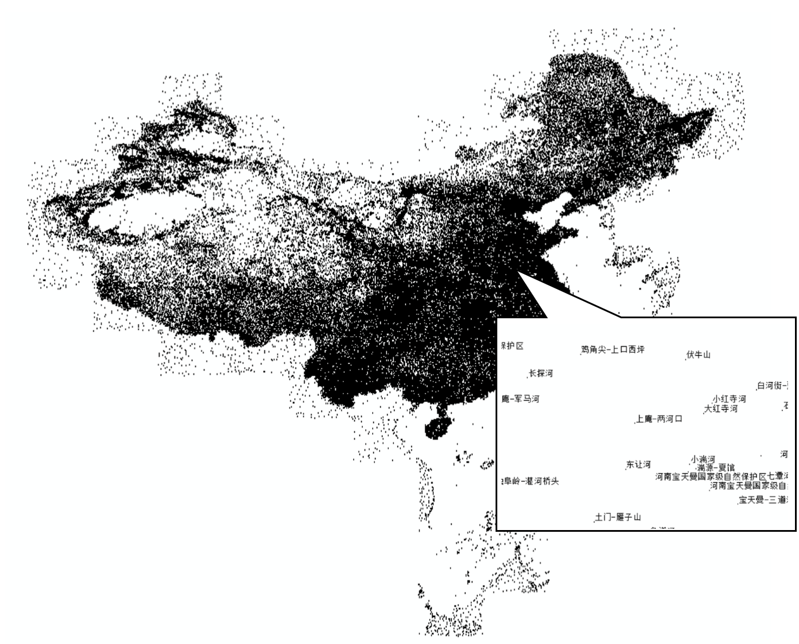
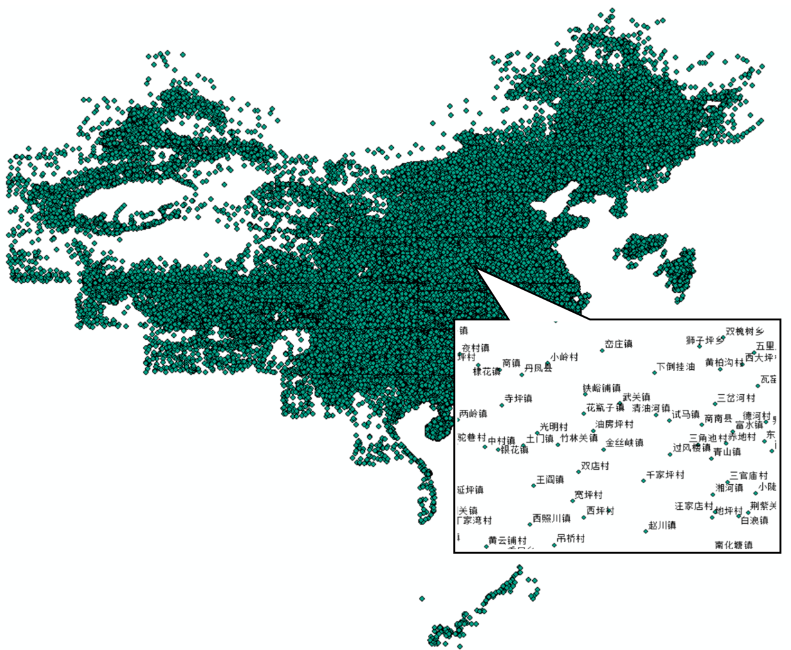
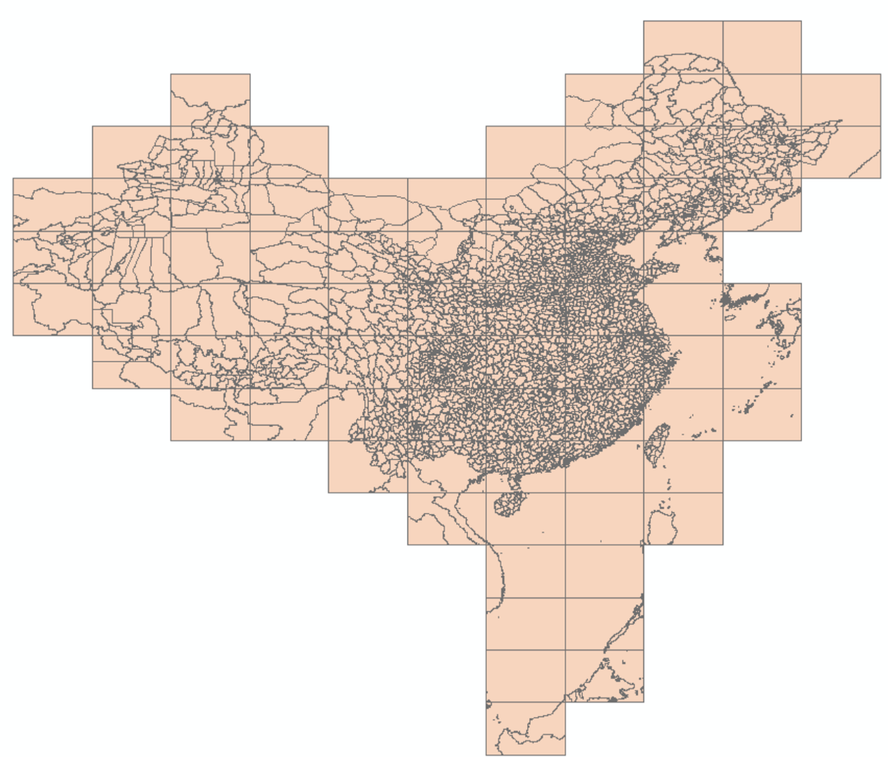
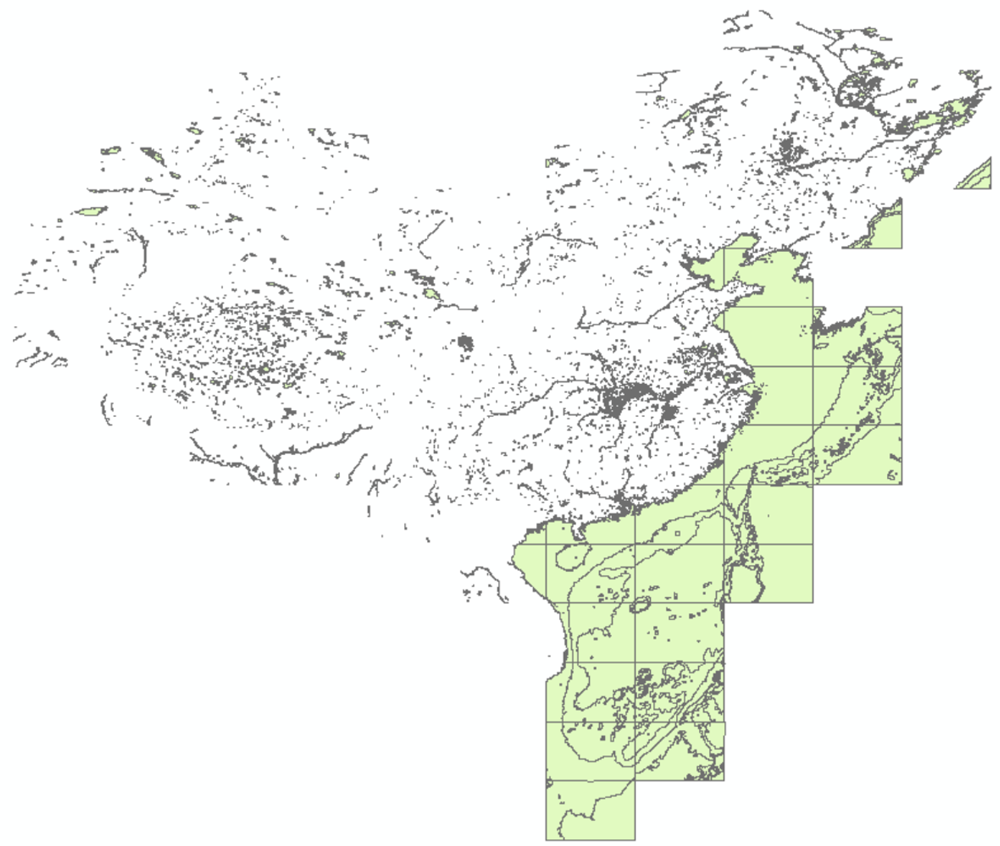
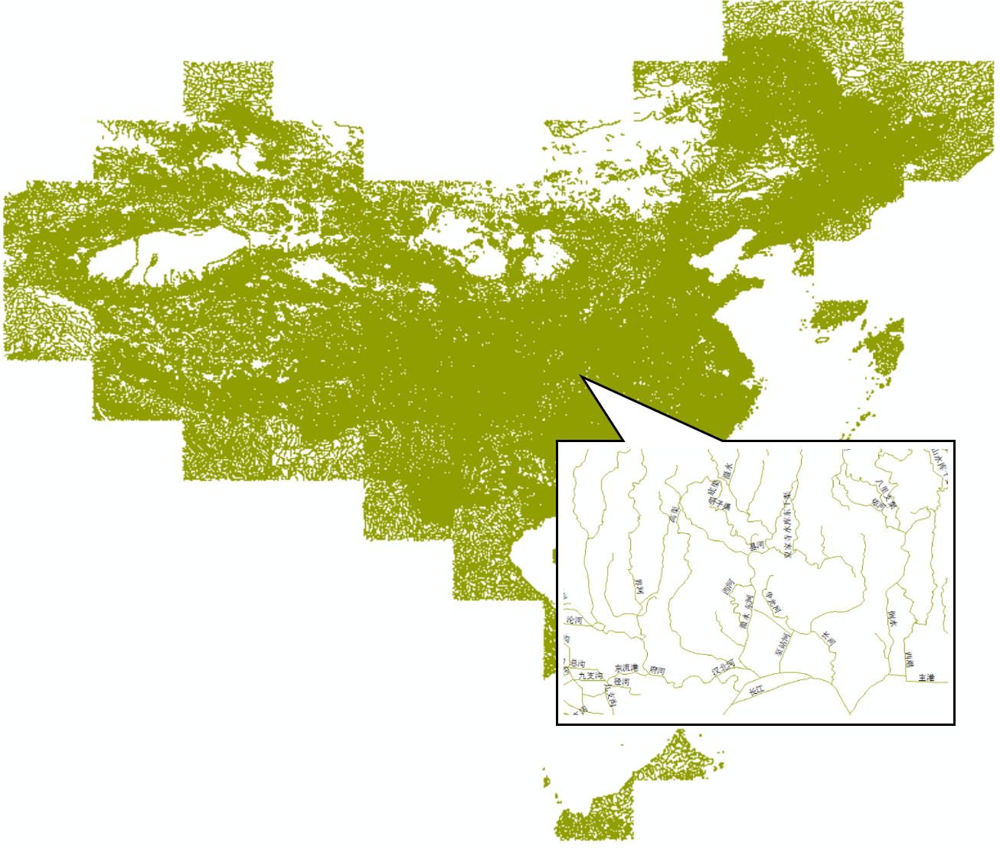
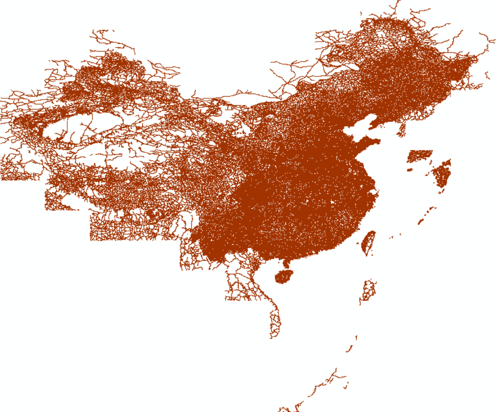

本文介绍国家标准地理数据的获取以及处理为 GMT 支持格式的方法。

<!--more-->

具体包括：

- 国家标准1:100万（非涉密）基础地理数据的申请、下载
- 数据集内容简介
- 数据集要素合并、提取
- 借助OGR工具将SHP转为GMT可用格式

{}
本文仅供个人科研作图参考。若使用者编制的地图需向社会公开的，请务必遵守《地图管理条例》有关规定依法履行地图审核程序。
{}

## 数据概况

国家基础地理信息中心于2017年11月份开始免费向公众提供全国1:100万非涉密的全国基础地理数据库。目前数据整体现势性为2017年。该数据库：

- 共77幅DLG数据集，包括全国陆地范围以及台湾岛、海南岛、钓鱼岛、南海诸岛在内的主要岛屿及其临近海域。
- 包括水系、居民地及设施、公路铁路、行政边界、地名等5个数据集12个数据层，如下图所示。



数据更多介绍可访问[全国地理信息资源目录服务系统](http://www.webmap.cn/commres.do?method=result100W)。

## 数据获取

- 进入[全国地理信息资源目录服务系统](http://www.webmap.cn)，点右上角“注册”。已注册用户直接登陆。
- 在“数据下载”栏目中，点击进入“1：100万全国基础地理信息数据库”。
- 该数据集下有77个图幅产品，当前最新生产时间是2017年。可选择一两个图幅，或全部选中，加入成果车。
- 结算，填写订单中的个人信息，**验证手机号**，下载数据。  **注：**若未提示验证手机，换个firefox浏览器试试。

## 数据集内容简介

该数据集包括5类12个要素层，分别为：

-   **AANP 自然地名（点）图层**：包括交通要素名、纪念地和古迹名、山名、水系名、海洋地域名、自然地域名等

    

-   **AGNP 居民地（点）图层**：包括各级行政地名和城乡居民地名称等

    

    该数据集包括首都、省会、直辖市、特别行政区、地级行政区、县级行政区以及乡镇，以识别码CLASS进行区分：

    | 行政区地名                                      | CLASS码 |
    |-------------------------------------------------|---------|
    | 省行政地名(直辖市、自治区、特别行政区)          | AB      |
    | 自治州、盟、地区行政地名                        | AC      |
    | 地级市行政地名                                  | AD      |
    | 县级市行政地名                                  | AE      |
    | 县级行政地名（自治县、旗、自治旗、地级市市辖区）| AF      |
    | 县辖区及县级行政区域的派出机构地名              | AG      |
    | 街道办事处地名                                  | AH      |
    | 镇行政地名                                      | AI      |
    | 乡行政地名                                      | AJ      |

-   **BOUA 各级行政区（面）图层**

    

    注：该数据集包含了分幅边界，进行单个行政区（例如某省、市）边界、面积提取时需先合并图层。

-   **BOUL 中国及邻区各级行政界限（线）图层**

    

    该数据集包括各级行政区界线，以GB码进行区分：

    行政区界类型         | GB码
    ------------------- | -----
    海岸线              | 250200
    水系交汇处          | 260100
    外国地区国界线      |	610200
    国界线(已定)        |	620201
    国界线(未定)        | 620202
    省级界线	          | 630200
    特别行政区界	      | 630400
    地、市、州级行政区界 |	640200
    县级行政区界（已定） |	650201
    特殊地区界限      	| 670202

-   **BOUP 领海基点(点)图层**
-   **HYDA 水系（面）图层，包括湖泊、水库、双线河流等**

    

    水系数据集以GB码区分：

    水系要素类型 | GB码
    ----------- | ----
    地面河流    | 210101
    时令河	     | 210200
    干涸河	     | 210300
    湖泊	      | 230101
    池塘	      | 230102
    时令湖	     | 230200
    干涸湖	     | 230300
    建成水库	  | 240101
    建设中水库	 | 240102

-   **HYDL 水系（线）图层，包括单线河流、沟渠、河流结构线等**

    

-   **HYDP 水系（点）图层，包括泉、井等**
-   **LRDL 公路（线）图层，包括国道、省道、县道、乡道、其它公路、街道、乡村道路等**

    

    不同行政等级公路数据以GB码进行区分，而不同技术等级以RTEG码区分。

-   **LRRL 铁路（线）图层**
-   **RESA.shp 居民地（面）图层**
-	**RESP 居民地（点）图层，包括普通房屋、蒙古包、放牧点等**

以上只列出了部分要素的分类编码，更多可参考基础地理信息要素分类与代码（GB/T 13923-2006）。

## 数据处理

从网站上直接下载的数据是分图幅的 geodatabase(gdb) 数据库文件，如果需要用 GMT 画“全国一张图”，需要：

- 合并77个gdb文件中的同类要素
- 提取某类要素中的某个等级数据
- 转为gmt识别的文本格式

### gdb数据库文件合并

可以使用FME软件、ArcGIS软件或直接编写Python批处理脚本进行gdb数据的批量合并。前两款软件比较大，若只需要对数据进行简单处理，可以利用Python的**ArcPy**包进行批处理：



其中，`infile`是77个gdb文件夹的目录，`out_location`是合并目录，`out_name`是合并为一个gdb数据库文件的名称。ArcPy可以随ArcGIS而安装，也可以单独安装。该代码将分幅的交通、水系、边界等12类要素分别合并为全国一张图，最后转为12个shp文件。

### 提取某类要素

由于每个数据集（一个shp文件）中存在不同等级的要素，而在实际使用中可能需要提取某省的居民地点数据，或仅国界、省界。所以需利用arcpy编程进一步提取。

例如：

已知行政区划`BOUL`图层中GB代码`620201`、`620202`、`250200`分别为已定国界、未定国界和海岸线，编写Python脚本，从`BOUL`图层中提取国界及海岸线要素：



其中，`infile`表示行政区划图层`BOUL.shp`所在的文件夹。代码运行后，从该图层中提取GB代码为`620201`、`620202`、`250200`的要素，保存到当前目录的`BOUL_1.shp`中.

### 格式转换

利用OGR库将shp文件转化为gmt可用的文本文件，具体可参考博文[GDAL/OGR: 地理空间数据格式转换神器](/blog/gdal-ogr/):

```
ogr2ogr -f GMT BOUL_1.gmt BOUL_1.shp
```

最后GMT绘图如下：

```
gmt psxy BOUL_1.gmt -R70/145/3/55 -JM105/35/6.5i > ChinaMap.ps
```

绘图结果如下：


