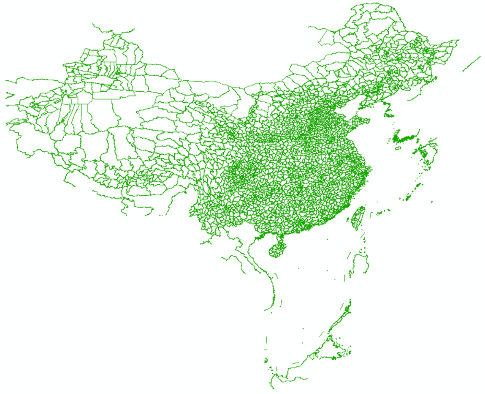
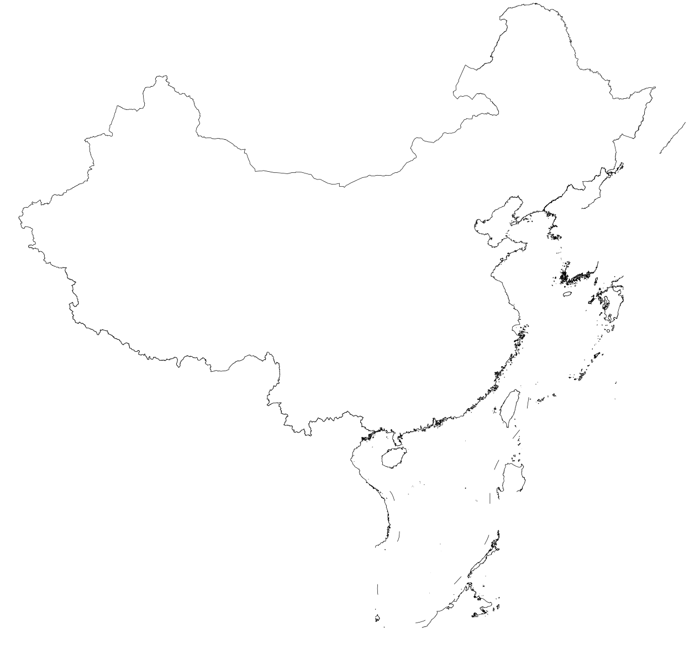

本文介绍国家标准地理数据的获取以及处理为 GMT 支持格式的方法。

<!--more-->

具体包括：

- 国家标准1:100万（非涉密）基础地理数据的申请、下载
- 数据集内容简介
- 数据集要素合并、提取及格式转换

{}
本文仅供个人科研作图参考。若使用者编制的地图需向社会公开的，请务必遵守
《地图管理条例》有关规定依法履行地图审核程序。
{}

## 数据概况

国家基础地理信息中心于2017年11月份开始免费向公众提供全国1:100万非涉密的全国基础地理数据库。目前数据最新为2018版，但仅2017版（整体现势性2015年）可供用户下载。该数据库：

- 共77幅DLG数据集，包括全国陆地范围以及台湾岛、海南岛、钓鱼岛、南海诸岛在内的主要岛屿及其临近海域。
- 包括水系、居民地及设施、公路铁路、行政边界、地名等5个数据集12个数据层。

数据更多介绍可访问[全国地理信息资源目录服务系统](http://www.webmap.cn/commres.do?method=result100W)。

## 数据获取

- 进入[全国地理信息资源目录服务系统](http://www.webmap.cn)，点右上角“注册”。已注册用户直接登陆。
- 在“数据下载”栏目中，点击进入“1：100万全国基础地理信息数据库”。
- 该数据集下有77个图幅产品。可选择一两个图幅，或全部选中，加入成果车。
- 结算，填写订单中的个人信息，**验证手机号**，下载数据。
  **注：**若未提示验证手机，换个firefox浏览器试试。

## 数据集内容简介

该数据集包括5类12个要素集，如下图所示：



每个要素集内又包括不同等级的自然地理要素，以BOUL要素集（图层）为例：

**BOUL 中国及邻区各级行政界限（线）图层**



该数据集包括各级行政区界线，以GB码进行区分：

行政区界类型         | GB码
------------------- | -----
海岸线              | 250200
水系交汇处          | 260100
外国地区国界线      |	610200
国界线(已定)        |	620201
国界线(未定)        | 620202
省级界线	          | 630200
特别行政区界	      | 630400
地、市、州级行政区界 |	640200
县级行政区界（已定） |	650201
特殊地区界限      	| 670202

其他各图层内不同要素的分类编码可参考基础地理信息要素分类与代码（GB/T 13923-2006）。

## 数据处理

从网站上直接下载的数据是分图幅的 geodatabase(gdb) 数据库文件，如果需要用 GMT画“全国一张图”，需要：

- 合并77个gdb文件中的同类要素
- 提取某类要素中的某个等级数据
- 转为gmt识别的文本格式

### gdb数据库文件合并

根据网友CovMat建议，采用本社区一贯推荐的GDAL/ORG库（[GDAL/OGR: 地理空间数据格式转换神器](/blog/gdal-ogr/)）将分幅的gdb数据进行批量合并：



若安装有python环境，还可选择`ogrmerge.py`工具进行批量的格式转换和合并，详见[ogrmerge使用手册](https://www.gdal.org/ogrmerge.html)。

该节将分幅的交通、水系、边界等12类要素分别合并为全国一张图，最后转为12个shp文件。

### 提取某类要素

由于每个数据集（一个shp文件）中存在不同等级的要素，而实际可能只使用其中一种，则仍可利用`ogr2ogr`工具提供的sql查询选项进行提取。

例如：

上文行政区划`BOUL`图层中GB代码`620201`、`620202`、`250200`分别为已定国界、未定国界和海岸线，那么提取数据并转化为GMT格式的命令为：

```
ogr2ogr -f GMT -where "GB=620201 or GB=620202 or GB=250200" BOUL_sub.gmt BOUL.shp
```

最后GMT绘图如下：

```
gmt psxy BOUL_sub.gmt -R70/145/3/55 -JM105/35/6.5i > ChinaMap.ps
```

绘图结果：



###### 版本更新记录：

- 2019-5-19: 采用网友CovMat建议，将ogr2ogr命令代替ArcPy进行数据集的合并和要素提取，并简化博文图文，突出重点；
- 2018-4-15：初稿；
