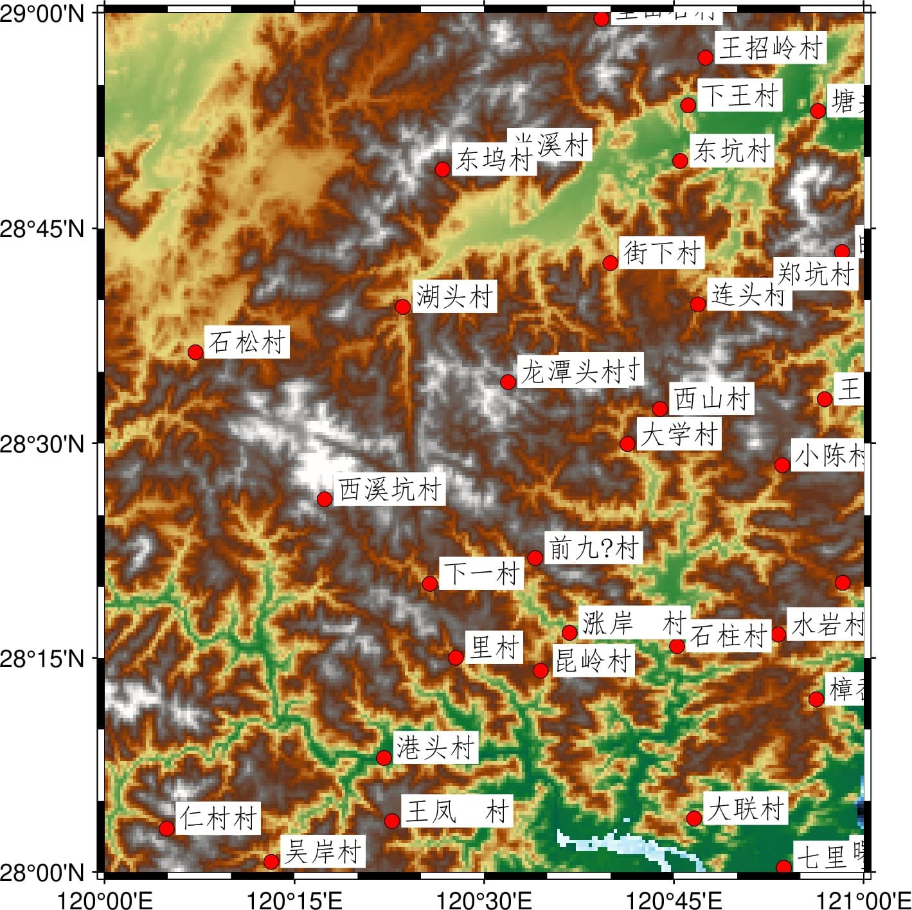

本文介绍国家标准地理数据的获取以及处理为 GMT 支持格式的方法。

<!--more-->

具体包括：

- 国家标准1:100万（非涉密）基础地理数据的申请、下载
- 数据集内容简介
- 数据集要素合并、提取及格式转换

{}
本文仅供个人科研作图参考。若使用者编制的地图需向社会公开的，请务必遵守
《地图管理条例》有关规定依法履行地图审核程序。
{}

## 数据概况

国家基础地理信息中心于2017年11月份开始免费向公众提供全国1:100万非涉密的全国基础地理数据库。目前数据最新为2021版。该数据库：

- 共77幅DLG数据集，包括全国陆地范围以及台湾岛、海南岛、钓鱼岛、南海诸岛在内的主要岛屿及其临近海域。
- 包括水系、居民地及设施、公路铁路、行政边界、地名等5个数据集12个数据层。

数据更多介绍可访问[全国地理信息资源目录服务系统](http://www.webmap.cn/commres.do?method=result100W)。

## 数据获取

- 进入[全国地理信息资源目录服务系统](http://www.webmap.cn)，点右上角“注册”。已注册用户直接登陆。
- 在“数据下载”栏目中，点击进入“1：100万全国基础地理信息数据库”。
- 该数据集下有77个图幅产品。可选择一两个图幅，或全部选中，加入成果车。
- 结算，填写订单中的个人信息，**验证手机号**，下载数据。
  **注：**若未提示验证手机，换个firefox浏览器试试。

## 数据集内容简介

该数据集包括5类12个要素集，如下图所示：



每个要素集内又包括不同等级的自然地理要素，以BOUL要素集（图层）为例：

**BOUL 中国及邻区各级行政界限（线）图层**


该数据集包括各级行政区界线，以GB码进行区分：

行政区界类型         | GB码
------------------- | -----
海岸线              | 250200
水系交汇处          | 260100
外国地区国界线      |	610200
国界线(已定)        |	620201
国界线(未定)        | 620202
省级界线	          | 630200
特别行政区界	      | 630400
地、市、州级行政区界 |	640200
县级行政区界（已定） |	650201
特殊地区界限      	| 670202

其他各图层内不同要素的分类编码可参考基础地理信息要素分类与代码（GB/T 13923-2006）。

此外，常用的还有 **AGNP 各级行政地名和城乡居民地坐标（点）图层**

行政地名点以政府驻地来定位，无GB码，以CLASS类别区分：

行政地名点类型                               | CLASS类别
------------------------------------------ | --------
国名                                         | AA
省（直辖市、自治区、特别行政区）行政地名          | AB
自治州、盟、地区行政地名                        | AC
地级市行政地名                                | AD
县级市行政地名                                | AE
县（自治县、旗、自治旗、地级市市辖区）级市行政地名 | AF
县辖区及县级行政区域的派出机构地名               | AG
街道办事处地名                                | AH
镇行政地名                                   | AI
乡行政地名                                   | AJ
建制村地名                                   | AK
城镇区片、小区名                              | BA
自然村、屯、片村、村民小组名                    | BB
牧点、渔点、棚房名                            | BC
其它                                        | BD
党政机关、党派团体名                          | CA
企事业单位名                                  | CB
农、林、牧、渔场                              | CC

## 数据处理

从网站上直接下载的数据是分图幅的 geodatabase(gdb) 数据库文件，如果需要用 GMT画“全国一张图”，需要：

- 合并77个gdb文件中的同类要素
- 提取某类要素中的某个等级数据
- 转为gmt识别的文本格式

### gdb数据库文件合并

采用本社区一贯推荐的[GDAL/ORG库](https://docs.gmt-china.org/latest/utilities/gdal/)将分幅的gdb数据进行批量合并。
首先解压所有下载的压缩包，得到以`.gdb`结尾的目录。目录名类似`H51.gdb`、`I49.gdb`等。
然后在这些目录的上级目录执行以下脚本：

Linux系统：


Windows系统：


若安装有python环境，还可选择`ogrmerge.py`工具进行批量的格式转换和合并，详见[ogrmerge使用手册](https://www.gdal.org/ogrmerge.html)。

该节将分幅的交通、水系、边界等12类要素分别合并为全国一张图，最后转为12个shp文件。

### 查询GB代码与CLASS类别

使用`ogrinfo`可以查询shp文件内包含哪些要素。例如以下命令查询`BOUL.shp`中包含的GB代码：

```
ogrinfo -sql "SELECT distinct GB FROM BOUL" BOUL.shp
```

而以下命令则查询`AGNP.shp`中包含的CLASS类别：

```
ogrinfo -sql "SELECT distinct CLASS FROM AGNP" AGNP.shp
```

### 提取某类要素

由于每个数据集（一个shp文件）中存在不同等级的要素，而实际可能只使用其中一种，则仍可利用`ogr2ogr`工具提供的sql查询选项进行提取。

例如：

行政区划`BOUL`图层中GB代码`620201`、`620202`、`250200`分别为已定国界、未定国界和海岸线，那么提取数据并转化为GMT格式的命令为：

```
ogr2ogr -f GMT -where "GB=620201 or GB=620202 or GB=250200" BOUL_sub.gmt BOUL.shp
```

最后GMT绘图如下：

```
gmt begin ChinaMap
    gmt plot BOUL_sub.gmt -R70/145/3/55 -JM105/35/6.5i 
gmt end show
```

绘图结果：


如果想要提取行政地名点`AGNP`图层中的建制村信息（对应CLASS为AK），则使用：

```
ogr2ogr -f GMT -where "CLASS='AK'" AGNP.gmt AGNP.shp
```

注意因为CLASS类别为字符串，所以此处`AK`需要加上引号。GB代码为整型数因而不需要加引号。

最后转换成的GMT格式数据如下：

```
...
# @NCLASS|NAME|PINYIN|GNID|XZNAME
# @Tstring|string|string|string|string
# FEATURE_DATA
# @DAK|岙里王村|Aoliwangcun|330226114037|胡陈乡
121.68517089 29.388652295
# @DAK|坝头村|Batoucun|331022000000|亭旁镇
121.310746425 29.0109724900001
# @DAK|白岩村|Baiyancun|331082111028|尤溪镇
120.971417165 28.7226002200001
# @DAK|柏树下村|Baishuxiacun|331082116042|邵家渡街道
121.257111875 28.8522451100001
...
```

以 Windows 系统为例，首先将以上数据的编码转换为GB2312，再使用以下代码绘制：

```
gmt begin AGNP jpg
  gmt set PS_CHAR_ENCODING Standard+

  gmt basemap -R120/121/28/29 -JM10c -Baf
  gmt grdimage @earth_relief_03s -Cgeo
  gmt plot -Sc0.2c -Gred -W0p,black AGNP.gmt
  chcp 936
  gmt convert AGNP.gmt -a2="NAME" | gmt text -F+f10p,40+jTL -D0.15c/0.3c -Gwhite
gmt end
```

绘图结果：

