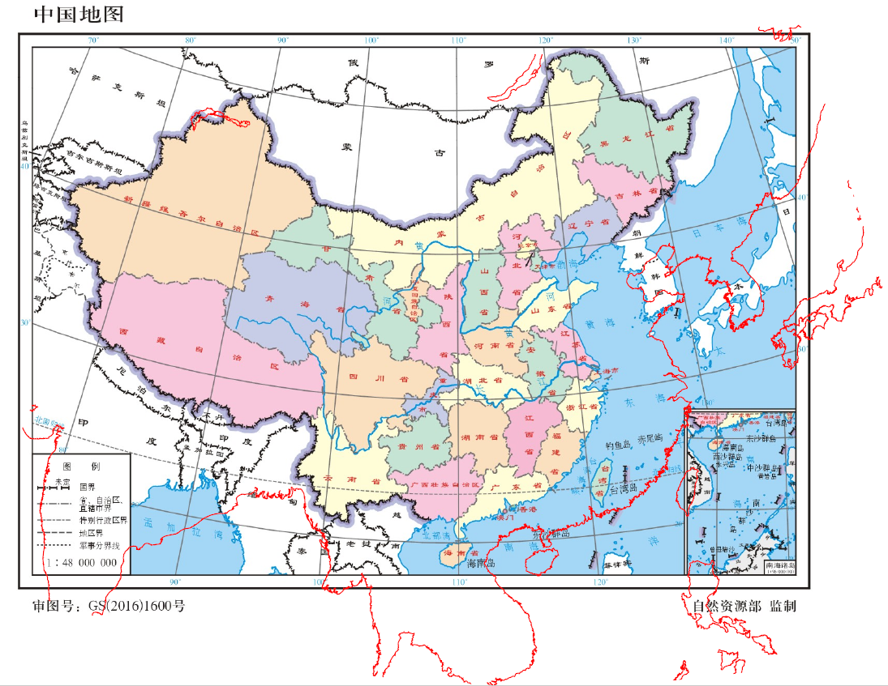
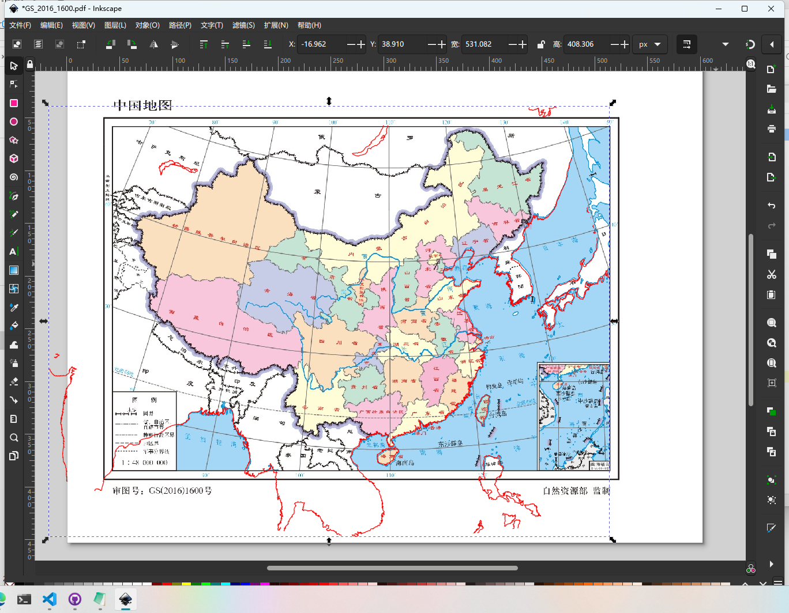
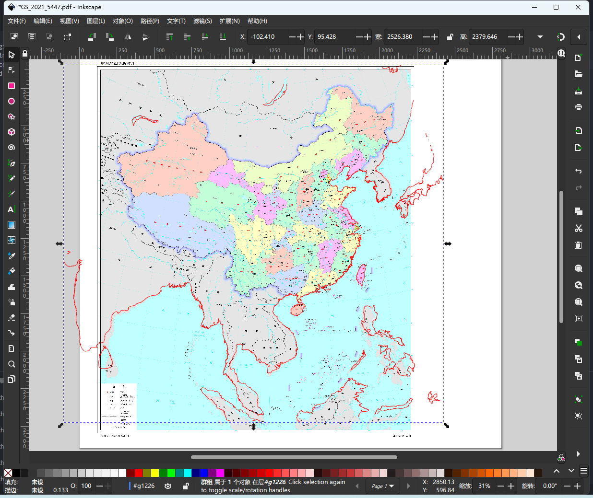

在国内期刊发表文章时，如果插图中带有行政边界，通常需要提交地图的审图号。
个人向自然资源部提交审图申请十分麻烦，比较现实的做法是使用[自然资源部标准地图服务](http://bzdt.ch.mnr.gov.cn/)
提供的带审图号的地图为底图。然而标准地图通常只有 jpg, eps 格式，不带有数字化的坐标信息，
因此在 GMT 中使用较为困难。

由于官方未公布标准地图所使用的详细投影参数，因此我们只能进行尝试、猜测，将 GMT 画出的图像与标准地图进行叠加、比较，
以此获得较为近似的投影参数。本文作者尝试出了两张标准地图的近似投影参数，审图号分别为 GS(2016)1600 号、GS(2021)5447 号。
GMT 画出的图像能够较为近似地匹配标准地图。下面详细介绍 GMT 如何使用这两张标准地图为底图，仅为抛砖引玉，为读者提供思路。
希望读者未来能够提出更好的方法使用标准地图。

## 获取标准地图

[自然资源部标准地图服务](http://bzdt.ch.mnr.gov.cn/) 上这两张标准地图的名字分别为：

- 中国地图 1:4800万 64开 分省设色 有邻国 线划二
- 中国地图 1:1000万 对开 分省设色 有邻国 线划二

下载两张标准地图的 jpg 格式文件（官网提供的 eps 文件 GMT 无法加载），重命名为`GS_2016_1600.jpg`和`GS_2021_5447.jpg`。

## 在 GMT 中调用

以 GS(2016)1600 号为例，使用以下脚本调用底图，并绘制 GMT 的图层：

```
gmt begin GS_2016_1600 pdf
  # 加载标准地图 GS(2016)1600 号
  gmt image GS_2016_1600.jpg -Dx0/0
  
  # 近似投影参数 -Jb110/40/25/47/1:48000000
  gmt coast -Jb110/40/25/47/1:48000000 -R70/140/10/55 -W0.5p,red -A10000
  ...
  # 以下是绘制其他 GMT 图件的命令
  ...
gmt end
```

近似投影参数`-Jb110/40/25/47/1:48000000`只能确保绘制出的 GMT 图层和标准地图比例尺相同、形状基本相等。但位置仍然存在偏移：



下一步我们需要使用矢量图编辑软件，编辑这个 PDF 文件，将 GMT 图层移动到合适的位置，匹配标准地图。
读者可以使用商业软件 Adobe Illustrator，也可以使用开源免费的 Inkscape。



在本例中，笔者绘制了红色的海岸线作为参照物，对标准地图进行叠加匹配。读者在具体实践中，也可以在某个经纬度绘制一个参考点，
和标准地图经纬线的交点进行匹配。

匹配好之后，可以在矢量图编辑软件中删除多余的图件，保存导出即可。

对于 GS(2021)5447 号，可以使用以下近似投影参数：

```
gmt begin GS_2021_5447 pdf
  # 加载标准地图 GS(2021)5447 号
  gmt image GS_2021_5447.jpg -Dx0/0
  
  # 近似投影参数 -Jb105/0/25/47/1:10000000
  gmt coast -Jb105/0/25/47/1:10000000 -R70/140/0/55 -W2p,red -A10000
gmt end
```

对于这个标准地图，在中国大部分区域都能较好地匹配，但在南亚与东南亚地区则偏差较大：



## 抛砖引玉

自然资源部提供的标准地图非常多，投影参数也各不相同，笔者难以一一尝试猜测。本文仅为读者提供一种思路。如果读者得到了更为精确的投影参数，欢迎到本社区的 GitHub issue 中提出：

https://github.com/gmt-china/gmt-china.org