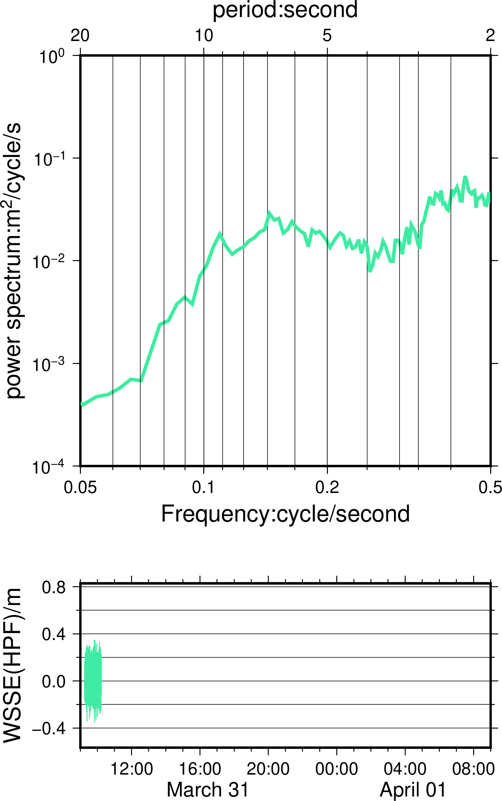

### 问：GMT自带的movie程序怎么制作动画？是否简单易用？

答：[movie](https://docs.generic-mapping-tools.org/dev/movie.html#s)是GMT的一个动画制作程序，设计的比较复杂，上手时间长，不易用。希望尝试的话，可以运行自带例子，你会发现它设计的使用方法和经典GMT是差别很大的，个人学习的使用经历比较糟糕。

### 问：那怎么利用GMT做GIF动画？
答：可以使用[ImageMagick](https://imagemagick.org)工具，只需要一行命令即可。
```
magick convert -delay 64 -loop 0 *.png  out.gif
```
首先使用GMT制作每帧png，然后用上面的命令把连续的png图像制作成GIF动画。（GMT movie的基本原理可能也是如此，但设计的复杂度太高）


### 例子
这里以GNSS浮标观测的海面波动为例，希望展示波浪的时间变化规律。动画设置每一帧显示一个小时的波浪功率谱图像，不同帧使用不同的颜色表达。


### Code
以下代码适用于Linux Bash：
```
#!/usr/bin/env bash
gmt set FORMAT_DATE_MAP "o dd" FORMAT_CLOCK_MAP hh:mm 
gnss1=./gnss_b1_hlf_allppk.txt
R=-R32400/119700/-0.565631/0.828242
# ==========================================================================================================
for((i=1;i<=23;i++));  
do   
	echo $i
	((name = $i + 100))
	ps=a00$name.ps
	r=$(($RANDOM%255))
	g=$(($RANDOM%255))
	b=$(($RANDOM%255))
	
	((max =  $i * 3600))
	((min = ($i-1) * 3600))
	echo $min

	gmt psbasemap -R2019-03-31T09:00:00/2019-04-01T09:00:00/-0.565631/0.828242 -Bpxa4Hf1h -Bsxa1Df1D -Bpya0.4g0.2f0.2+l"WSSE(HPF)/m" -JX10c/4c -BWSne -K > $ps
	gmt psbasemap -R2/20/1e-4/1e0 -JX-10cl/10cl -Bxa2f3g3+l"period:second" -Bya-1pg+l"power spectrum:m@+2@+/cycle/s" -BWNse -K  -Y2.7i -O >> $ps
	
	awk 'NR<'"$max"' && NR>'"$min"'  {print $1,$2}' $gnss1 | gmt spectrum1d  -S256 -W --GMT_FFT=brenner -N -i1 -D1 > pow5.txt
	awk ' NR<'"$max"'   {print $1,$2}' $gnss1| gmt psxy  $R  -JX10c/4c -W0.5p,lightgray -P -K -O -Y-2.7i >> $ps
	awk 'NR<'"$max"' && NR>'"$min"'  {print $1,$2}' $gnss1| gmt psxy  $R  -JX10c/4c -W0.5p,$r/$g/$b -P -K -O  >> $ps
	gmt psxy -R2/20/1e-4/1e0 -JX-10cl/10cl -K pow5.txt -W2.25p,$r/$g/$b -O -Y2.7i -i0,1 >> $ps

	gmt psbasemap -R0.05/0.5/1e-4/0.5 -JX10cl/10cl -Bxa2f3g3+l"Frequency:cycle/second" -BS  -O >> $ps
gmt psconvert $ps -A -Tg
done
magick convert -delay 64 -loop 0 *.png  out.gif

```

### 结果



### 在一张图上
如果是做PPT展示用，动画较好。如果是插入论文，则需要把不同时间的曲线叠加到一张图上，同样使用`for`循环。Linux Bash代码如下:

```
#!/usr/bin/env bash
# Testing gmt spectrum1d power spectrum values
gmt set FORMAT_DATE_MAP "o dd" FORMAT_CLOCK_MAP hh:mm 
ps=test.ps

# ==========================================================================================================
# Use GMT spectrum to calculate power spetrum of SSH
gnss1=./gnss_b1_hlf_allppk.txt
gnss2=./gnss_b2_hlf_allppk.txt

gmt psbasemap -R2019-03-31T09:00:00/2019-04-01T09:00:00/-0.565631/0.828242 -Bpxa4Hf1h -Bsxa1Df1D -Bpya0.4g0.2f0.2+l"WSSE(HPF)/m" -JX10c/4c -BWSne -K > $ps
gmt psbasemap -R2/20/1e-4/1e0 -JX-10cl/10cl -Bxa2f3g3+l"period:second" -Bya-1pg+l"power spectrum:m@+2@+/cycle/s" -BWNse -K  -Y2.7i -O >> $ps

R=-R32400/119700/-0.565631/0.828242
echo period > period1_wind.txt
# echo period > period_l.txt
# GNSS buoy1 set i<=23;
# GNSS buoy2 set i<=24;
for((i=1;i<=23;i++));  
do   
	echo $i
	r=$(($RANDOM%255))
	g=$(($RANDOM%255))
	b=$(($RANDOM%255))
	# ((a=1+2**3-4%3))
	((max =  $i * 3600))
	((min = ($i-1) * 3600))
	echo $min
	# echo $(expr $i \* 3 + 1);  
	# awk 中使用变量的小技巧“‘val’”
	
	awk 'NR<'"$max"' && NR>'"$min"'  {print $1,$2}' $gnss1 | gmt spectrum1d  -S256 -W --GMT_FFT=brenner -N -i1 -D1 > pow5.txt
	awk 'NR<'"$max"' && NR>'"$min"'  {print $1,$2}' $gnss1| gmt psxy  $R  -JX10c/4c -W0.5p,$r/$g/$b -P -K -O -Y-2.7i >> $ps
	gmt psxy -R2/20/1e-4/1e0 -JX-10cl/10cl -K pow5.txt -W2.25p,$r/$g/$b -O -Y2.7i -i0,1 >> $ps

	gmt gmtselect -R2/7/1e-4/1e0 pow5.txt | sort -k 2 | tail -n 1| awk '{print '"$i+8"',$1}' >> period1_wind.txt
done
gmt psbasemap -R0.05/0.5/1e-4/1e0 -JX10cl/10cl -Bxa2f3g3+l"Frequency:cycle/second" -BS  -O -K>> $ps

###B2
gmt psbasemap -R2019-03-31T09:00:00/2019-04-01T09:00:00/-0.565631/0.828242 -Bpxa4Hf1h -Bsxa1Df1D -Bpya0.4g0.2f0.2+l"WSSE(HPF)/m" -JX10c/4c -BwSnE -K  -X11c -Y-2.7i -O >> $ps
gmt psbasemap -R2/20/1e-4/1e0 -JX-10cl/10cl -Bxa2f3g3+l"period:second" -Bya-1pg+l"power spectrum:m@+2@+/cycle/s" -BwNsE -K  -Y2.7i -O >> $ps

R=-R32400/119700/-0.565631/0.828242
echo period > period2_wind.txt
# GNSS buoy1 set i<=23;
# GNSS buoy2 set i<=24;
for((i=1;i<=24;i++));  
do   
	echo $i
	r=$(($RANDOM%255))
	g=$(($RANDOM%255))
	b=$(($RANDOM%255))
	# ((a=1+2**3-4%3))
	((max =  $i * 3600))
	((min = ($i-1) * 3600))
	echo $min
	# echo $(expr $i \* 3 + 1);  
	# awk 中使用变量的小技巧“‘val’”
	
	awk 'NR<'"$max"' && NR>'"$min"'  {print $1,$2}' $gnss2 | gmt spectrum1d  -S256 -W --GMT_FFT=brenner -N -i1 -D1 > pow5.txt
	awk 'NR<'"$max"' && NR>'"$min"'  {print $1,$2}'  $gnss2| gmt psxy  $R  -JX10c/4c -W0.5p,$r/$g/$b -P -K -O -Y-2.7i >> $ps
	gmt psxy -R2/20/1e-4/1e0 -JX-10cl/10cl -K pow5.txt -W2.25p,$r/$g/$b -O -Y2.7i -i0,1 >> $ps
	gmt gmtselect -R2/7/1e-4/1e0 pow5.txt | sort -k 2 | tail -n 1| awk '{print '"$i+8"',$1}' >> period2_wind.txt
done
gmt psbasemap -R0.05/0.5/1e-4/1e0 -JX10cl/10cl -Bxa2f3g3+l"Frequency:cycle/second" -BS  -O >> $ps

gmt psconvert $ps -A -Tf
rm gmt.* h_f.txt smooth_track* t.d
```


### 获取数据

[GNSS data 1](https://www.jianguoyun.com/p/DXyywDoQ2PCQBxjrxaAD)
[GNSS data 2](https://www.jianguoyun.com/p/DedS1rAQ2PCQBxirpOMD)

### 注意点

- [GraphicsMagick](http://www.graphicsmagick.org)是从[ImageMagick](https://imagemagick.org/)中分离出来的，推荐下载ImageMagick。

### 原文链接

原文转载自作者公众号

