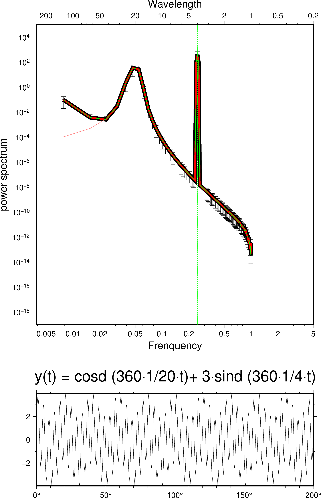

傅里叶变换是常用的计算信号频率（功率谱）的工具，各种编程语言都可以简单的快速实现FFT变换。GMT作为绘图工具，不仅可以绘图，也集成了非常强大的地学数据处理功能，对一维、二维的数据都可以实现傅里叶变换，从而确定出信号的频率信息。

`spectrum1d`([help-page](https://docs.generic-mapping-tools.org/latest/spectrum1d.html))是计算一维信号频域信息的工具，它采用了Welch的计算方法，该方法在[Matlab](https://www.mathworks.com/help/signal/ref/pwelch.html)中也经常使用，优点是可靠、易编程，结果易理解。

GMT开发者给出了一个例子，可参考[github](https://github.com/GenericMappingTools)，但是例子中的数学稍微不易理解。经过修改，输入信号修改为两个周期三角函数的叠加，经过测试，GMT可以准确地计算出频率和波长。
<!--more-->
```
#!/usr/bin/env bash
# Testing gmt spectrum1d power spectrum values

ps=power1D.ps

# First to generate a signal with fixed frequency using math.

# ---------------------------------------------------------------------------
# This is the math example from GMT developer, but hard to understand. So we do not use it here.
# gmt math -T0/10239/1 T 10240 DIV 360 MUL 400 MUL COSD = t.txt
# ---------------------------------------------------------------------------

# ---------------------------------------------------------------------------
# This is the math example that easy to understand. 
gmt math -T0/200/0.5 T 20 DIV 360 MUL COSD T 4 DIV 360 MUL SIND 3 MUL ADD = t.txt
# The same with up line but with unit of radian.
# gmt math -T0/200/0.5 T 20 DIV 6.28 MUL COS T 4 DIV 6.28 MUL SIN 3 MUL ADD = t.txt
# ---------------------------------------------------------------------------

gmt psxy `gmt gmtinfo t.txt -I0.000001` t.txt -JX6i/2i -Bxaf+u@. -Byaf -BWSne+t"y(t) = cosd (360@~\327@~1/20@~\327@~t)+ 3@~\327@~sind (360@~\327@~1/4@~\327@~t)" -W0.2p -P -K -Xc > $ps

gmt spectrum1d t.txt -S256 -W --GMT_FFT=brenner -N -i1 -D0.5 > pow5.txt

gmt psxy -R0.2/256/1e-19/1e5 -JX-6il/6.5il -Bxa2f3+l"Wavelength" -Bya-2p+l"power spectrum" -BWN -O -K -Y3.5i pow5.txt -W6.25p >> $ps
gmt psxy -R -J -O -K pow5.txt -Sc0.04i -Gblack -Ey >> $ps

gmt spectrum1d t.txt -S256 --GMT_FFT=brenner -N -i1 -W -L -D0.5> pow5.txt
gmt psxy -R -J -O -K pow5.txt -W0.5p,lightred >> $ps
gmt psxy -R -J -O -K -W0.25p,lightred,- << EOF >> $ps
20	1e-19
20	1e5
EOF

# The same result using -N
cut -f2 t.txt | gmt spectrum1d -S256 -W -Nv4 -D0.5
gmt psxy -R -J -O -K v4.xpower -W2.25p,red >> $ps

# wavelength is the reverse of the frequency, the result is the same but a increasing x-axis and a decreasing x-axis
gmt spectrum1d t.txt -S256 --GMT_FFT=brenner -N -i1 -D0.5> pow5.txt
# The X-axes length of wavelength is the reciprocal of frequency.
gmt psxy -R0.00390625/5/1e-19/1e5 -JX6il/6.5il -O -K pow5.txt -BSE -Bxa2f3+l"Frenquency" -W0.5p,green >> $ps
gmt psxy -R -J -O -W0.25p,green,- << EOF >> $ps
0.25	1e-19
0.25	1e5
EOF

gmt psconvert $ps -A -Tg


```
结果如下图


## ATTENTION

- GMT功率谱使用的Welch方法，输出的数值服从Parseval 定理。 The sum of the squares of your input data should equal the sum of the squares of the outputs from spectrum1d.
- 实际上GMT spectrum1D输出的结果服从这样的能量守恒：sum(x.^2-mean(x)^2)/(length(x)/bin_width)*delta_t=sum(xf). x为输入信号，xf为输出的功率密度，bin_width为-S设置的数据宽度,delta_t为数据采样间隔。
- 功率密度曲线在wavenumber上的积分（就是围城的面积），等于输入信号的方差。
- matlab读入数据测试
```
load .\ex\t.txt
load .\ex\pow5.txt
tmp = t(:,2);
tmp2 = pow5(:,2);

% 两个守恒，第一个是能量密度的累加守恒
sum(tmp.^2-mean(tmp)^2)/(length(tmp)/128)% 和下面的信号和守恒。delta_t=1
sum(tmp2)
sum(tmp2.*tmp1)*2*10 %这是能量x频率
% 第二个是方差和积分的关系
sum(tmp.^2-mean(tmp)^2)/(length(tmp)-1) %方差计算和下行一致
mean(tmp.^2)-mean(tmp)^2 % 通过方差的计算公式计算方差
trapz ((pow5(:,1)),(tmp2)) % 这是面积积分，结果与方差一致。
std(tmp)^2 % 这是MATLAB自带函数的方差计算

```
- 默认使用detrend。如果加-L，则不守恒。
- 输入信号波的振幅和功率谱密度的数值有什么关系？如果是正玄波，PSD积分得到的方差和幅值的关系是0.5*A^2。
- 方差和信号的周期无关，例如正弦波的周期为1和2时，只要振幅一样，那么方差也一样。
- ~~频率越大，PSD的峰值越窄，也就是能量越集中。~~ 这个表述是错误的。图上的宽窄是由于loglog坐标轴带来的视觉效果。
- 关于[variance-preserving spectra](https://selipot.github.io/blog/variance-preserving-spectra/)，VPS不能很准确的用于寻找周期。例如，在PSD中，两个周期不同但振幅系统的波，在VPS中的幅度就不一样了，VPS改变了PSD形状。
- [Mathmaticas](https://www.sciencedirect.com/topics/mathematics/power-spectral-density)
- [能量信号、功率信号、频谱、能量谱、功率谱、及一些定理](https://www.cnblogs.com/htj10/p/8638275.html)

### 原文链接

原文转载自作者公众号

