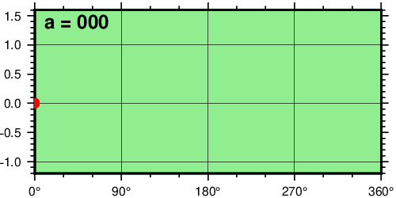
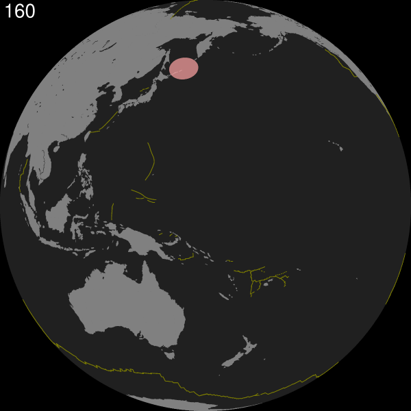

GMT的动画功能是版本6之后新增加的，主要是调用`movie`程序，隐藏中间过程，直接制作gif图或者视频。因为偏难，用的人也不多，至今`movie`的使用和反馈都不如其他功能。本文也仅仅以官方提供的两个例子为例，并非小编自己写的代码。自己编程写动画的话，可替代的途径是写`for`循环制图，然后使用`GM`一键制作动画。

>The movie module can generate GMT animation sequences using a single-plot script that is repeated for all frames, with some variation using specific frame variables. The module simplifies (and hides) most of the steps normally needed to set up a full-blown animation job. Instead, the user can focus on composing the main frame plot and let the parallel execution of frames and assembly of images into a movie take place in the background. Individual frames are converted from PostScript plots to lossless, transparent PNG images and optionally assembled into an animation (this last step requires external tools that must be present in your path; see Technical Details below). For opaque PNG images, simply specify a background color via -G.

GMT提供了多个[动画案例](https://docs.generic-mapping-tools.org/latest/animations.html)，今天用`地震分布`的例子简单介绍其用法。

## 准备
GMT动画需要安装`GraphicsMagick`（图片GIF）和`FFmpeg`（视频），下载地址：
>http://www.graphicsmagick.org/
https://www.ffmpeg.org/

安装后，确保window系统`path`路径中已经包含上述程序，一般情况下，win和linux都可以自动添加路径，无需再操作。

## 测试

先运行[例1](https://docs.generic-mapping-tools.org/latest/animations.html)进行测试，检查是否已经具备条件。

注意，需要修改主程序中`$# -eq 0`为`$# -eq 1`，或改为任意个非`0`数字。

```
if [ $# -eq 1 ]; then	# Just make master PostScript frame 0
	opt="-Mps -Fnone"
else	# Make animated GIF
	opt="-A+l"
fi
```

然后运行，期间中间会产生许多临时文件，结束后会自动删除这些文件，仅仅保留动画。结果如下：



## 地震随时间演变的视频

下面是[例子8](https://docs.generic-mapping-tools.org/latest/animations.html)的代码，作者是GMT创始人Paul，同样需要注意修改`0`为非`0`。
```
#!/usr/bin/env bash
#               GMT ANIMATION 08
#
# Purpose:      Show one year (2013) of Pacific seismicity events
# GMT modules:  convert, math, makecpt, movie, coast, plot, events
# Unix progs:   cat
# Note:         Run with any argument to build movie; otherwise one frame is plotted only.

if [ $# -eq 1 ]; then   # Just make master PostScript frame 100
        opt="-M100,ps -Fnone"
        ps=anim_08.ps
else    # Make movie in MP4 format and a thumbnail animated GIF using every 5th frame
        opt="-Fmp4 -A+l+s5"
fi

# Test reading directly from URL
# Note: The URL tends to change every few years...
# 1. Extract 2018 data from URL and prepare inputs and frame times
cat << EOF > pre.sh
SITE="https://earthquake.usgs.gov/fdsnws/event/1/query.csv"
TIME="starttime=2013-01-01%2000:00:00&endtime=2013-12-31%2000:00:00"
MAG="minmagnitude=5"
ORDER="orderby=time-asc"
URL="\${SITE}?\${TIME}&\${MAG}&\${ORDER}"

gmt begin
	gmt convert \$URL -i2,1,3,4+s50,0 -hi1 > q.txt
	gmt makecpt -Cred,green,blue -T0,70,300,10000 -H > movie_dem.cpt
	gmt math -T2013-01-01T/2013-12-31T/2 --TIME_UNIT=d TNORM 40 MUL 200 ADD = times.txt
gmt end
EOF

# 2. Set up main script
cat << EOF > main.sh
gmt begin
	gmt coast -Rg -JG\${MOVIE_COL1}/5/6i -G128 -S32 -X0 -Y0 -A500
	gmt plot @ridge.txt -W0.5p,darkyellow
	gmt events q.txt -SE- -Cmovie_dem.cpt --TIME_UNIT=d -T\${MOVIE_COL0} -Es+r2+d6 -Ms5+c0.5 -Mi1+c-0.6 -Mt+c0
gmt end
EOF

# 3. Run the movie
gmt movie main.sh -Sbpre.sh -C6ix6ix100 -Ttimes.txt -Nanim_08 -Gblack -H2 -Lc1 -Z --FONT_TAG=20p,Helvetica,white --FORMAT_CLOCK_MAP=- $opt
rm -rf main.sh pre.sh
```

中间依旧产生许多文件，不需要管。最后得到的结果为：

<center>GIF图</center>

视频：
<video id="video" controls="" preload="none">
    <source id="mp4" src="anim_08.mp4" type="video/mp4">
</video>
<center>2013年大于5级的地震发生分布</center>

## 加入地形图的视频渲染

Paul还制作了一个更为复杂的动画视频，加入了地形和光照，渲染时间花费约1个小时。

<video id="video" controls="" preload="none">
    <source id="mp4" src="ani.mp4" type="video/mp4">
</video>
<center>Pacific Earthquakes in 2018</center>

>The movie took ~1 hour to render on a 24-core MacPro 2013.
