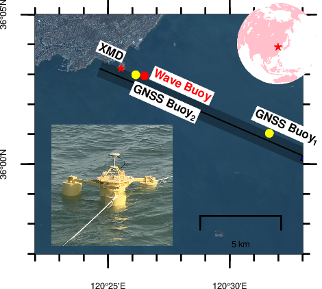

## 绘制前的处理
卫星遥感影像一般是Geotif格式，UTM笛卡尔数学投影，灰度值一般是Float32类型，而GMT不支持Float32类型，此外高分影像分辨率可到m级，绘图所占存储非常大。所以需要做的是

- 将Float32转为Byte格式。
- 将影像降低分辨率
如果整幅区域过大，则还需要裁剪出目标区域:
- 裁剪影像
如果不希望绘图使用UTM坐标，而偏向于使用WGS-84椭球经纬度，则进行坐标转换
- 坐标转换

上述预处理完全使用GMT内置的gdal工具包。如果因版本问题，GMT不带有gdal，则手动下载gdal即可。GDAL在window和linux通用，使用方法：
```
# Prepare
# 1-Transform from UTM to WGS-84 latitude/longitude
gdalwarp -t_srs EPSG:4326 name.tif name_wgs.tif
# 2- resample Geotif to 90m resolution(0.00075 degree)
gdal_translate -tr 0.00075 0.00075  -r average -ot Float32  -co COMPRESS=LZW -q name_wgs.tif name_wgs_low.tif
# 3-Transform the DoubleFloat format to byte format.
gdal_translate -ot Byte -q -scale 0 1 0 255 name_wgs_low.tif name_wgs_lowbyte.tif
# 4-Crop (Can do first)
gdalwarp -t_srs EPSG:4326 -te 115.8152 35.4555 116.0756 35.7101 name.tif name_out.tif
```

## RGB真彩色绘制
完成预处理后，添加真彩色的绘图仅需一行：
```
gmt grdimage area_cal_low_byte.tif+b2,1,0 -J$J -R$R -K -O >> $PS
```
需要注意的是，`+b2,1,0`表示波段的顺序，红绿蓝三个波段的叠加产生真彩色，其顺序不可颠倒，波段的编号和具体卫星有关，需要提前查找准确。

## 添加无坐标图片
有时候（审稿人）可能要求在地图上加一个图片表达，图片没有坐标，可通过相对位置插入：
```
gmt psimage gnss2.jpg -Dx0.2/0.1+w1.5c -O -K >> $PS
```

## 绘制小地图
在大比例尺的地图上添加一个小比例尺的位置指示地图是常用做法，也很简单：
```
gmt pscoast -Rg -JG120/41/1c  -Dc -A5000 -Gpink -Swhite  -O -X2.5c -Y2.1c -K >>$PS
echo  120:26:30 36:02:57 | gmt psxy -Sa0.1c -Gred -R -J -O  >> $PS
```
## 例子结果


## 数据获取
回复本公众号0227，可以获得卫星遥感的绘图代码和示例数据（还有原始的练习数据：山东郓城县2020年Landsat8遥感影像）。


## 全部代码
```
#!/bin/bash

R=120:22/120:33/35:57/36:05
J=m120:30/36/1:500000
# Here use the map scale not the absolute width in map projection. This will allow the line width in cm unit connected to the geographical units km.

PS=map.ps

gmt gmtset  FORMAT_GEO_MAP = ddd:mm:ssF MAP_FRAME_PEN 0.010c
gmt gmtset FONT_ANNOT_PRIMARY	= 3p
gmt gmtset FONT_LABEL 7 MAP_LABEL_OFFSET 5p MAP_ANNOT_OBLIQUE=42
gmt gmtset MAP_FRAME_TYPE plain MAP_TICK_LENGTH_PRIMARY 5p  MAP_FRAME_PEN black

gmt psbasemap -R$R -J$J -P -K  -Bpxa5mf -Bpya5mf -BnWSe >$PS
# Add image. 
gmt grdimage area_cal_low_byte.tif+b2,1,0 -J$J -R$R -K -O >> $PS
gmt pscoast -R$R -J$J -O  -W -I1 -K  -Lx1.0i/0.15i+c120/36+w5k >> $PS
awk '{print $1, $2}' track.dat | gmt psxy -W0.2c,black -R$R -J$J -P -O -K -t70 >> $PS
awk '{print $1, $2}' track.dat | gmt psxy -W0.01c,black+ve0.1i+gblue -R$R -J$J -P -O -K  >> $PS

angle=`gmt mapproject -R$R -J$J -Af  track.dat | gmt gmtmath STDIN -i2 -Sl MEAN 360 SUB 90 SUB NEG =`
echo "angle:"$angle

awk 'NR==3 {print $1, $2}' buoy.txt | gmt psxy -Sa0.1c -Gred -R$R -J$J -P -O -K >> $PS
awk 'NR==3 {print $1, $2,"XMD"}' buoy.txt |  gmt pstext -F+f4p,1,black+a$angle+jRB -R$R -J$J -O -N -K -D0./0.1 -Gwhite >> $PS

echo  120:26:30 36:02:57 | gmt psxy -Sc0.1c -Gred -R$R -J$J -O -K >> $PS
echo  120:26:30 36:02:57 "Wave Buoy"|  gmt pstext  -F+f4p,1,red+a$angle+jLB -R$R -J$J -O -N -K -D0.1/0.0 -Gwhite >> $PS

echo  120:26:8.53 36:2:59 "GNSS Buoy@-2@-@"|  gmt pstext  -F+f4p,1,black+a$angle+jLT -R$R -J$J -O -N -K -D0./-0.1 -Gwhite >> $PS
echo  120:30:41.03 36:1:36.69 "GNSS Buoy@-1@-@"|  gmt pstext -F+a$angle+f4p,1,black+jLB -R$R -J$J -O -N -K -D0.1/0. -Gwhite >> $PS
echo  120:26:8.53 36:2:59 | gmt psxy -Sc0.1c -Gyellow -R$R -J$J -O -K >> $PS
echo  120:31:38.03 36:1:1.69 | gmt psxy -Sc0.1c -Gyellow -R$R -J$J -O -K>> $PS

# Add jpg
gmt psimage gnss2.jpg -Dx0.2/0.1+w1.5c -O -K >> $PS
# Add small map in Up-Right corner
gmt pscoast -Rg -JG120/41/1c  -Dc -A5000 -Gpink -Swhite  -O -X2.5c -Y2.1c -K >>$PS
echo  120:26:30 36:02:57 | gmt psxy -Sa0.1c -Gred -R -J -O  >> $PS

gmt psconvert $PS -A -P -Tf

```