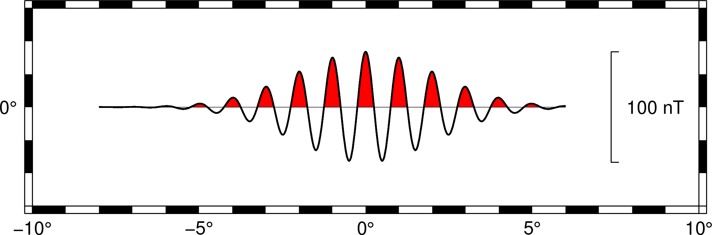
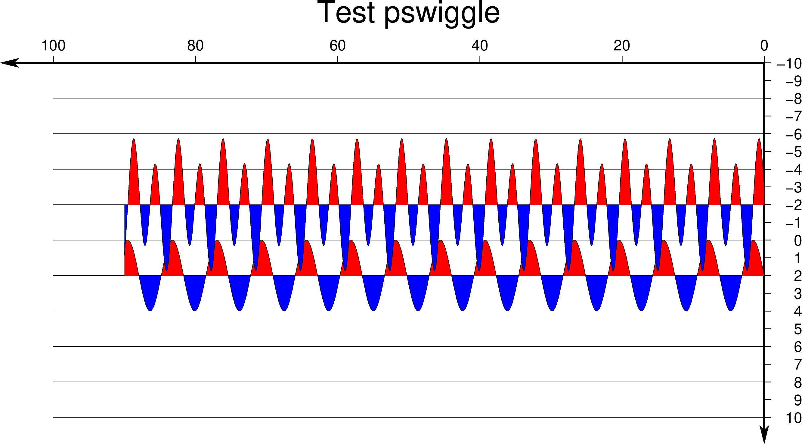

本文介绍`pswiggle`的用途，可对不同类型的值填充不同颜色，在地震研究领域可能用到这类图形。


GMT的官方文档给出一个简单的例子，首先使用math作出一个时间序列，然后通过管道`|`传递给widdge，不过这个例子的数学公式有点长，很难一下看明白。但可以清楚的看出这个程序主要是用来绘制异常值的颜色填充。这里的异常值可简单理解为均值之外的值，大于均值为正，小于均值为负。然后可以对正或者负进行不同颜色的填充。

```
$ gmt math -T-8/6/0.01 -N3/0 -C2 T 3 DIV 2 POW NEG EXP T PI 2 MUL MUL COS MUL 50 MUL = | gmt wiggle -R-10/10/-3/3 -JM6i -B -Z100i -DjRM+w100+lnT -Tfaint -Gred+p -W1p -BWSne -png map
```


为了方便理解其用法，下面小编给出笛卡尔坐标系下的一个简单例子。首先用awk作出正弦函数以及叠加的正余弦周期函数，并用widdge绘制图像，这里需要注意`-z`比例因子的用法。

>-Zscale[units]
>Gives anomaly scale in data-units/distance-unit, where distance-unit is the currently chosen unit specified by PROJ_LENGTH_UNIT. Alternatively, append a distance-unit among the other choices (c|i|p).

此外如果需要改变坐标轴的方向，设置`-JX-20c/-10c`中的宽度为负。

```bash
#!/bin/bash
# Test psw. leiyang@fio.org.cn

ps=example_XX.ps

gmt psbasemap -R0/100/-10/10 -JX-20c/-10c -Bx20f20 -By1g2 -BEN+t"Test pswiggle" -K --MAP_FRAME_TYPE=graph --MAP_VECTOR_SHAPE=0.5 > $ps
awk 'BEGIN{for(i=0;i<=90;i=i+0.1) print i,2,sin(i)}' > fortrack.dat
# gmt psxy fortrack.dat -R -J -O -K -W3p,0_6:0 --PS_LINE_CAP=round >> $ps
gmt pswiggle fortrack.dat -R -K -J -G+red -G-blue -Z1 -Wthinnest -O >> $ps

awk 'BEGIN{for(i=0;i<=90;i=i+0.1) print i,-4,cos(i)+3*sin(2*i)}' > fortrack.dat
# gmt psxy fortrack.dat -R -J -O -K -W3p,0_6:0 --PS_LINE_CAP=round >> $ps
gmt pswiggle fortrack.dat -R -J -G+red -G-blue -Z2 -Wthinnest -O >> $ps
psconvert $ps -A -Tg -P
rm *.dat

```



### 原文链接

原文转载自作者公众号

