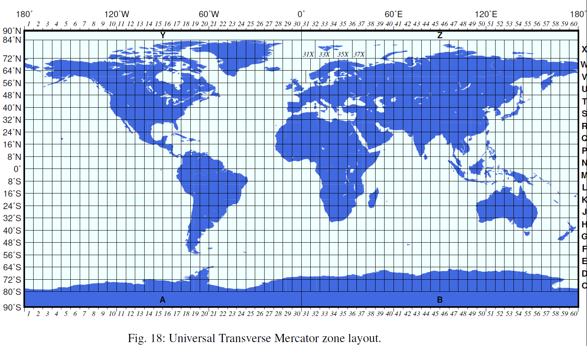
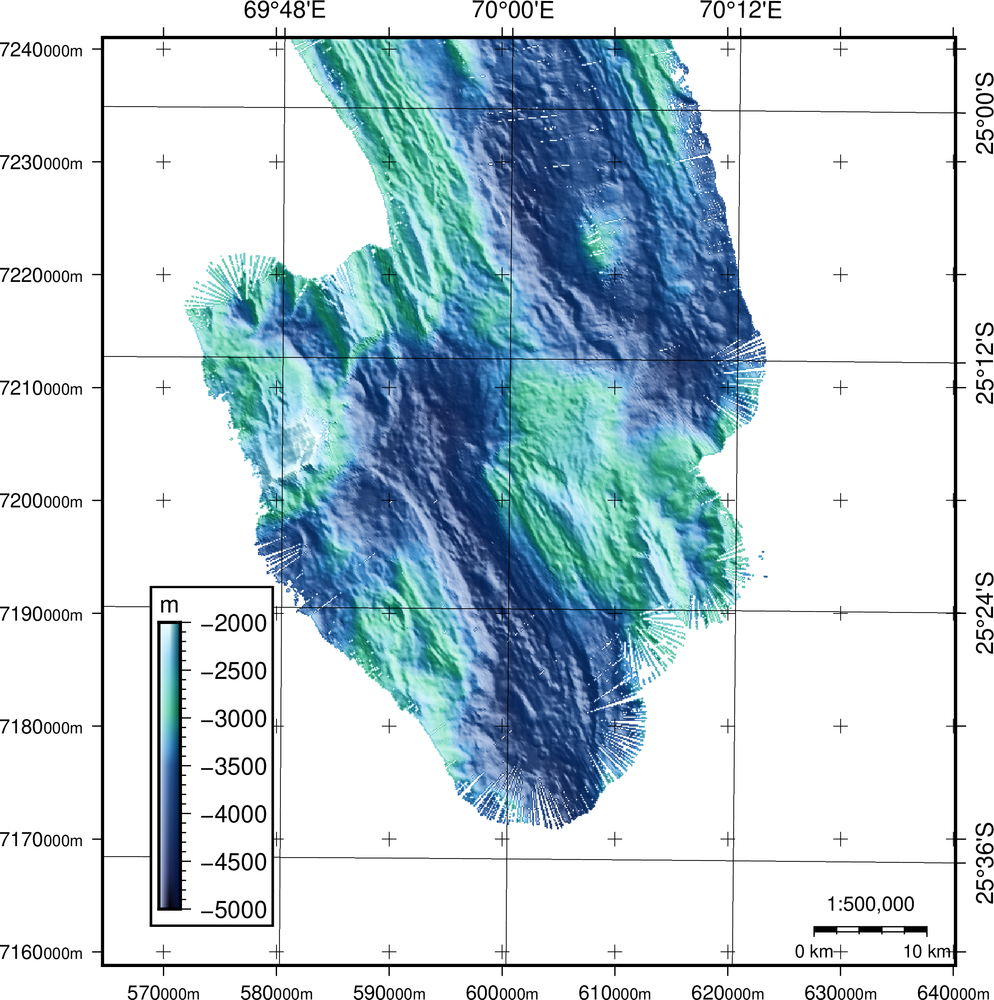

今天分享一个GMT绘制平面几何坐标的例子，以UTM投影为例子。

## UTM 投影

- UTM为投影后的平面坐标，即把球面展开到纸面的坐标。

可使用`grdinfo`查看文件投影类型：
```
$ gmt grdinfo test3.tiff
test3.tiff: Title: Grid imported via GDAL
test3.tiff: Command:
test3.tiff: Remark:
test3.tiff: Gridline node registration used [Cartesian grid]
test3.tiff: Grid file format: gd = Import/export through GDAL
test3.tiff: x_min: 564600 x_max: 640200 x_inc: 100 name: x n_columns: 757
test3.tiff: y_min: 7158800 y_max: 7241000 y_inc: 100 name: y n_rows: 823
test3.tiff: z_min: -4458.4609375 z_max: -1930.5826416 name: z
test3.tiff: scale_factor: 1 add_offset: 0
+proj=utm +zone=42 +south +ellps=WGS84 +towgs84=0,0,0,0,0,0,0 +units=m +no_defs
```

信息显示该数据为UTM带号为42的南半球投影。代号和字母编码可以通过下图查询：


<center>UTM代号（来源：GMT官网）</center>

## 绘制经纬度地图

不转坐标，直接绘图(windows版)：

```
REM Test Geotif format using GMT 
gmt gmtset FORMAT_GEO_MAP = ddd:mmF
gmt gmtset MAP_FRAME_WIDTH=2p
gmt gmtset FONT_ANNOT_PRIMARY 12p,Helvetica,black FONT_LABEL 16p,Helvetica,black 

gmt makecpt -Cbathy -T-5000/-2000/20 >test.cpt

gmt grdimage test3.tiff -Jx1:500000 -I+a45+nt1 -Ctest.cpt  -K -P -Q > test.ps

gmt pscoast -Rtest3.tiff -Ju42K/1:500000 -O -Df+ -Gyellow -W0.5p -Ba12mg12m -BNE -K --MAP_ANNOT_OBLIQUE=45>>test.ps

gmt psbasemap -R -J -O -LjRB+c25:00S+f+w10k+l1:500,000+u+o0.2i --FONT_ANNOT_PRIMARY=9p --FONT_LABEL=10p -K>>test.ps

gmt psbasemap -Rtest3.tiff+Uk -Jx1:500 -B10g10+u"@:8:000m@::" -BWSne -O --FONT_ANNOT_PRIMARY=10p --MAP_GRID_CROSS_SIZE_PRIMARY=0.1i --FONT_LABEL=10p -K >> test.ps

gmt psscale -DjBL+o1c+w2i/0.15i -R -J -Ctest.cpt -Bx500f100 -By+lm -I -O -F+gwhite+p1p >> test.ps

gmt psconvert test.ps -A -P -Tg
```

效果：


这张水深地图上有两种坐标标注，一种是UTM坐标，一种是经纬度坐标。它们之间的切换是通过`-J`的变化实现的，UTM使用了`-JX1:500000`，经纬度投影使用了`-Ju42K/1:500000`。

第二种方法是先转坐标：
```
gmt grdproject -Ju42K/1:1 test3.tiff -C -F -I  -Gtest3_geo.tiff
```
查看坐标转换：

```
$ gmt grdinfo test3_geo.tiff
test3_geo.tiff: Title: Produced by grdproject
test3_geo.tiff: Command: grdproject -Ju42K/1:1 test3.tiff -C -F -I -Gtest3_geo.tiff
test3_geo.tiff: Remark:
test3_geo.tiff: Gridline node registration used [Geographic grid]
test3_geo.tiff: Grid file format: nf = GMT netCDF format (32-bit float), CF-1.7
test3_geo.tiff: x_min: 69.6398826025 x_max: 70.3970837978 x_inc: 0.00100158888272 name: longitude n_columns: 757
test3_geo.tiff: y_min: -25.687188402 y_max: -24.9398146068 y_inc: 0.00090921386277 name: latitude n_rows: 823
test3_geo.tiff: z_min: -4459.3125 z_max: -1926.97009277 name: z
test3_geo.tiff: scale_factor: 1 add_offset: 0
test3_geo.tiff: format: netCDF-4 chunk_size: 152,138 shuffle: on deflation_level: 3
GEOGCS["unnamed ellipse",
    DATUM["unknown",
        SPHEROID["unnamed",6378137,298.257223563]],
    PRIMEM["Greenwich",0],
    UNIT["degree",0.0174532925199433]]

```

已经完成转换，按照正常方法进行经纬度地图绘制即可。

## 数据获取

https://www.jianguoyun.com/p/Ddn04lUQ2PCQBximq-cD
