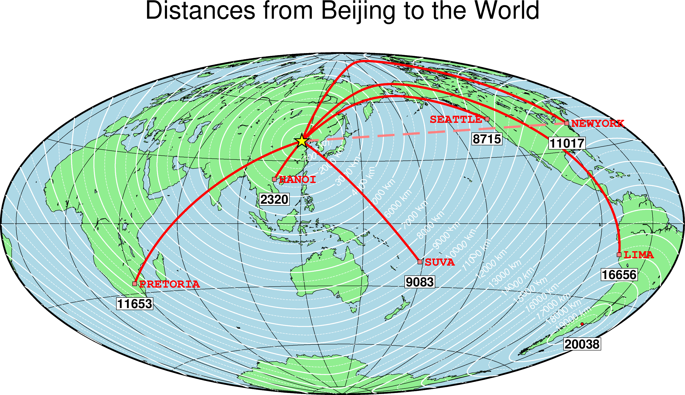

中科院测地所[郝晓光](http://www.hxgmap.com/)研究员编制了竖版世界地图，并且凸显出了北极的战略性意义，指出北京到纽约最近路线通过北冰洋而不是太平洋。这和人们在传统地图上看到的可能不太符合，通过[GMT](https://docs.generic-mapping-tools.org/6.0/index.html)可以计算大圆距离，并在不同的投影上进行绘图，展示北京到纽约的实际最短航线。
<!--more-->
先描述一个概念：

>大圆航线(Great circle distance)
把地球看做一个球体，通过地面上任意两点和地心做一平面，平面与地球表面相交看到的圆周就是大圆。两点之间的大圆劣弧线是两点在地面上的最短距离。沿着这一段大圆弧线航行时的航线称为大圆航线。由于大圆航线是两点之间的最短航线，故有时称为最经济航线。

>大地线（Geodesic Lines）是大地测量学术语，指地球椭球面上两点间的最短程曲线。

可近似认为大地线和大圆航线是不同领域的同一事物的不同说法。区别是大圆航线假设地球是球体，大地线则按照参考椭球来计算曲面上的两点距离，计算结果和参考椭球的选择有关系，但是差异很小。

## 大圆航线的计算
首先计算北京到纽约的最短距离，即大圆航线距离。可以使用`mapproject`计算两个点之间的大圆距离以及大地线距离。

```
$ echo 116.4 39.9 | mapproject -G-74/40.7+uk --FORMAT_FLOAT_OUT=%.8f -jg --PROJ_ELLIPSOID=WGS-84
116.40000000    39.90000000     11018.99486842
$ echo 116.4 39.9 | mapproject -G-74/40.7+uk --FORMAT_FLOAT_OUT=%.8f -je --PROJ_ELLIPSOID=WGS-84
116.40000000    39.90000000     11016.52648868
$ echo 116.4 39.9 | mapproject -G-74/40.7+uk --FORMAT_FLOAT_OUT=%.8f -je --PROJ_ELLIPSOID=TOPEX
116.40000000    39.90000000     11016.52528943
```
上面分别计算了大圆、大地线WGS-84椭球、大地线TOPEX椭球的北京到纽约的距离，可见大圆和大地线的差异不大。GMT中用于计算大圆航线的地球半径是采用一个假设与参考椭球等面积的球体半径 （[authalic radius](https://en.wikipedia.org/wiki/Earth_radius#Authalic_radius)）。对于WGS-84椭球，长半轴为6378.1370km，短半轴为6356.7523km，对应等面积的球体半径是6,371.0072km（这就是计算大圆航线的球体半径）。而大地线的计算则选择指定的参考椭球，椭球的选择对大地线的距离影响很小，对于长距离的计算基本可以忽略误差。结果表明北京到纽约的大圆距离是11018km，大地线距离是11016km。

GMT中大圆航线距离计算的地球半径是指定参考椭球的等面积球体半径在计算大圆航线时也可以通过`PROJ_MEAN_RADIUS`设置其他半径，例如对应参考椭球的等体积球体半径。
```
$ echo 116.4 39.9 | mapproject -G-74/40.7+uk --FORMAT_FLOAT_OUT=%.8f -jg --PROJ_ELLIPSOID=WGS-84 --PROJ_MEAN_RADIUS=volumetric
116.40000000    39.90000000     11018.98381501
$ echo 116.4 39.9 | mapproject -G-74/40.7+uk --FORMAT_FLOAT_OUT=%.8f -jg --PROJ_ELLIPSOID=WGS-84 --PROJ_MEAN_RADIUS=authalic
116.40000000    39.90000000     11018.99486842
```

GMT中大地线的计算有不同的方法，可以通过`PROJ_GEODESIC`设定，但是改变此算法对计算结果的影响很小。

```
$ echo 116.4 39.9 | mapproject -G-74/40.7+uk --FORMAT_FLOAT_OUT=%.8f -je --PROJ_ELLIPSOID=WGS-84  --PROJ_GEODESIC=Rudoe
116.40000000    39.90000000     11016.52656371
$ echo 116.4 39.9 | mapproject -G-74/40.7+uk --FORMAT_FLOAT_OUT=%.8f -je --PROJ_ELLIPSOID=WGS-84  --PROJ_GEODESIC=Vincenty
116.40000000    39.90000000     11016.52648868
```

## 北京到全球的最短路线

使用grdmath计算出北京到全球各地大圆距离的网格数据（NetCDF格式），图上的大圆航线垂直于网格文件的等值线。代码如下：
```
#!/usr/bin/env bash
#		Based on GMT EXAMPLE 23
#		edited by leiyang@fio.org.cn
# Purpose:	Plot distances from Beijing and draw shortest paths
# GMT modules:	grdmath, grdcontour, coast, plot, text, grdtrack
# Unix progs:	echo, cat, awk
#
gmt begin ex23 pdf,png
	# Position and name of central point:
	lon=116.40
	lat=39.90
	name="Beijing"

	# Calculate distances (km) to all points on a global 1x1 grid
	gmt grdmath -Rg -I1 $lon $lat SDIST = dist.nc

	# Location info for 5 other cities + label justification
	cat <<- END > cities.txt
	105.87	21.02	LM	HANOI
	282.95	-12.1	LM	LIMA
	178.42	-18.13	LM	SUVA
	237.67	47.58	RM	SEATTLE
	-74.00  40.70   LM	NEWYORK
	28.20	-25.75	LM	PRETORIA
	END
	gmt coast -R0/360/-80/80 -JT330/-45/9i -Glightgreen -Slightblue -A1000 -Bg30 -B+t"Distances from $name to the World" -Wthinnest
#	gmt coast -Rg -JH140/9i -Glightgreen -Slightblue -A1000 -Bg30 -B+t"Distances from $name to the World" -Wthinnest

	gmt grdcontour dist.nc -A1000+v+u" km"+fwhite -Glz-/z+ -S8 -C500 -Wathin,white -Wcthinnest,white,-

	# For each of the cities, plot great circle arc to Beijing with gmt plot
	gmt plot -Wthickest,red -Fr$lon/$lat cities.txt
	cat cities.txt | grep 'NEW' |	gmt plot -Wthickest,lightred,- -Fr$lon/$lat -A
	# Plot red squares at cities and plot names:
	gmt plot -Ss0.2 -Glightred -Wthinnest cities.txt

	gmt text -Dj0.15/0 -F+f12p,Courier-Bold,red+j -N cities.txt
	grdinfo dist.nc -M --FORMAT_FLOAT_OUT=0:%g,1:%g,2:%.0f| grep 'z_m'| awk -F: '{print $4}' | awk '{print $5,$8,$1}'| gmt text -D0/-0.2i -N -Gwhite -W -C0.02i -F+f12p,Helvetica-Bold+jCT
	# Place a yellow star at Beijing
	grdinfo dist.nc -M | grep 'z_m'| awk -F= '{print $(NF-1),$NF}'|awk '{print $1,$3}'|gmt plot -Sc0.1 -Gred -Wthinnest 
	echo "$lon $lat" | gmt plot -Sa0.2i -Gyellow -Wthin

	# Sample the distance grid at the cities and use the distance in integer km for labels
	gmt grdtrack -Gdist.nc cities.txt -o0-2 --FORMAT_FLOAT_OUT=0:%g,1:%g,2:%.0f \
		| gmt text -D0/-0.2i -N -Gwhite -W -C0.02i -F+f12p,Helvetica-Bold+jCT

	# Clean up after ourselves:
	rm -f cities.txt
gmt end show

```
## 两种投影的地图

### 横轴墨卡托投影 Transverse Mercator -JT330/-45/9i 

### 哈默投影 Hammer projection -JH140/9i
Hammer投影属于等面积投影，可以绘制全球地图。

从图上可看，北京到纽约的最短路线经过北冰洋上空，且临近北极点。北京到纽约的最短路线不经过太平洋而经过北极是完全正确的，尽管这确实和人们的普遍认知相违背。还可以看出，西海岸的西雅图到北京也基本不经过太平洋，而是临近北冰洋边缘的白令海，如此来说，美国国土发射向北京的导弹需要在近北极区域进行监测，那么我国的北斗等卫星计划考虑增加北极区域的覆盖范围也符合实际的。

此外可以看出地球上距离北京最远的点在南美洲阿根廷，大圆距离是2万公里。

### 原文链接

原文转载自作者公众号

