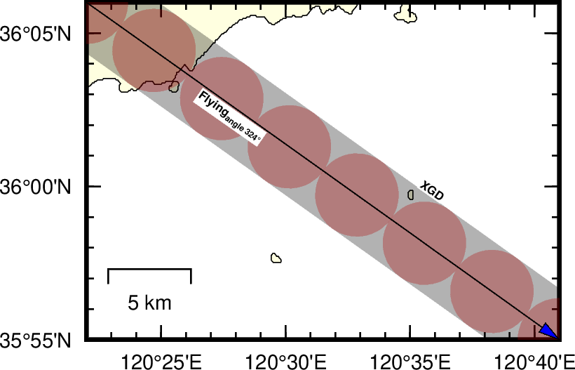

## 问答
问：GMT中psxy绘制线的宽度单位能设置为km吗？
答：psxy的线宽单位只有`c,i,p`，是没有办法直接设置地图中线的宽度是地理单位的，例如m，km等。

>Width is by default measured in points (1/72 of an inch). Append c, i, or p to specify pen width in cm, inch, or points, respectively.

问：就没有别的办法了吗？
答：可以通过设定地图比例尺`scale`，然后根据比例尺来计算出地图上1cm表示的实际地理长度。例如比例尺为`1:500000`时，线宽1m表示500,000米，1cm表示5km。

## 示例

```
#!/bin/bash

R=120:22/120:41/35:55/36:06
J=m120:30/36/1:500000
# Here use the map scale not the absolute width in map projection. This will allow the line width in cm unit connected to the geographical units km.

PS=xmd.ps

gmt gmtset MAP_FRAME_WIDTH = 0.1c FORMAT_GEO_MAP = ddd:mm:ssF
gmt gmtset FONT_ANNOT_PRIMARY	= 7p
gmt gmtset FONT_LABEL 7 MAP_LABEL_OFFSET 5p
gmt gmtset MAP_FRAME_TYPE plain MAP_TICK_LENGTH_PRIMARY -5p  MAP_FRAME_PEN black

gmt psbasemap -R$R -J$J -P -K  -Lx0.3i/0.3i+c120/36+w5k >$PS
gmt pscoast -R$R -J$J -O -Df -W -I1 -K -Glightyellow -Bpxa5mf -Bpya5mf -BnWSe >> $PS

cat << EOF > point.txt
120:22 36:06
120:41 35:55
EOF

gmt sample1d point.txt -Fa -T5k > p5km.txt
awk '{print $1,$2,5}' p5km.txt | gmt psxy -SE- -Gred -R$R -J$J -O -K -t70 >> $PS

gmt psxy point.txt -W1c,black -R$R -J$J -P -O -K -t70 >> $PS
gmt psxy point.txt -W0.01c,black+ve0.1i+gblue -R$R -J$J -P -O -K  >> $PS

angle=`gmt mapproject -R$R -J$J -Af  point.txt | gmt gmtmath STDIN -i2 -Sl MEAN 360 SUB 90 SUB NEG =`
echo "angle:"$angle

echo  120:26:8.53 36:2:55 "Flying@-angle 324@.@-@"|  gmt pstext  -F+f4p,1,black+a$angle+jLB -R$R -J$J -O -N -K -D0.1/0. -Gwhite >> $PS

echo  120:35:03 36:00:0.0 "XGD"|  gmt pstext -F+a$angle+f4p,1,black+jLB -R$R -J$J -O -N -D0.1/0. -Gwhite >> $PS

gmt psconvert $PS -A -P -Tg

rm  *.txt *.conf *.history
```



图中圆的直径的5km（通过`-SE-`），圆的采样间隔也是5km（通过`sample1d`），线的宽度为5km（通过`scale`），结果一致。

### 原文链接

原文转载自作者公众号

