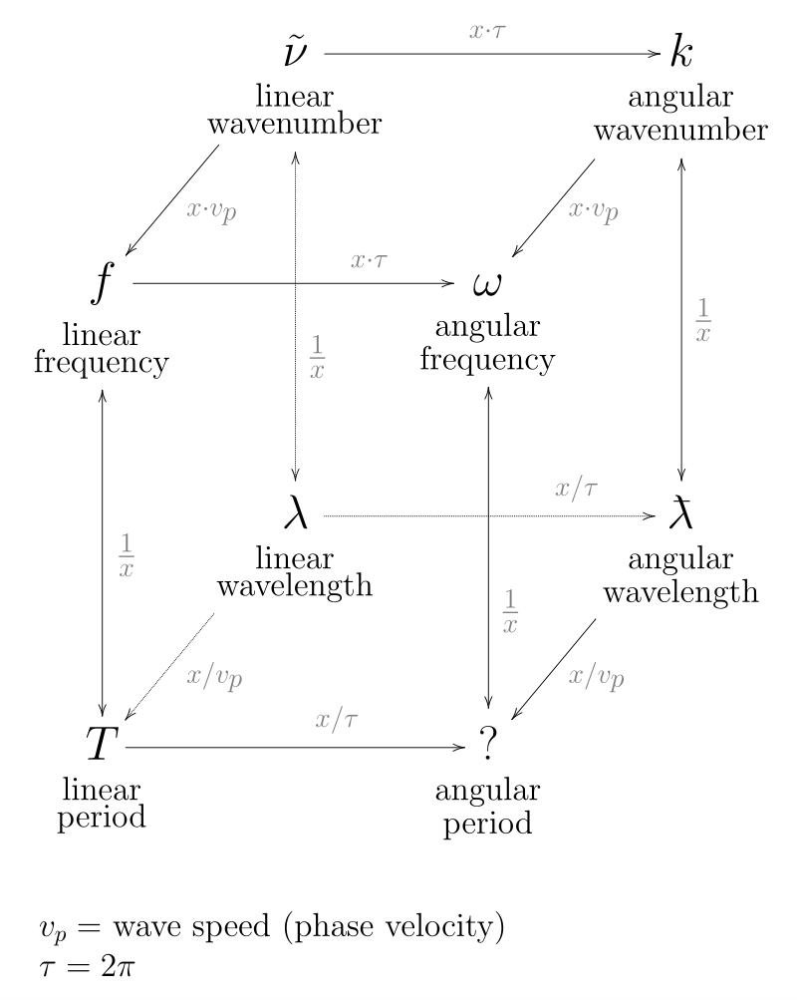
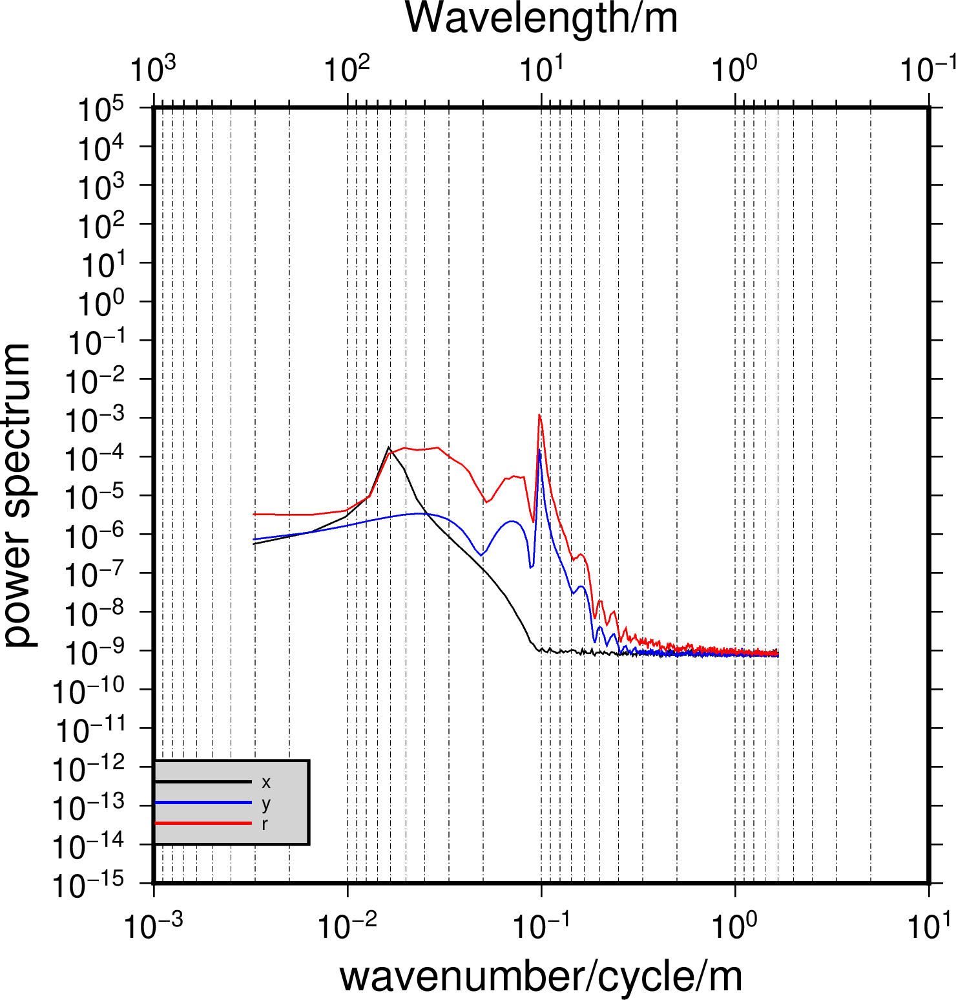
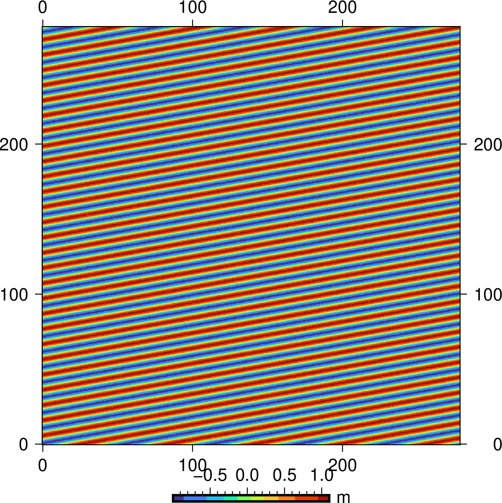

在物理海洋学中有一个常用的量叫做wavenumber，翻译为波数，其频谱叫做波数谱。一般来说，遥感和测绘学科中对波数谱较为陌生，大家使用最多的时间相关的频率谱，而波数谱是空间谱。海洋学中定点观测（如浮标）获得的数据一般是时间序列，可以计算频率谱，而卫星（如高度计）得到的是沿轨数据，属于空间域，卫星数据可以用于计算波数谱。本文简单对此介绍，并使用GMT和MATLAB做简单的模拟，以求两种维度的谱概念清晰易懂。

## wavenumber是什么？和frequency是什么关系？
- wavenumber是空间域频率，相当于单位长度有多少个波，也就是波数，其物理单位可以是CPKM(cycle per km)。 所谓波数谱分析就是指空间域的FFT分析，可以是一维的along-track分析，也可以是二维的空间分析，波数谱分析的Y轴单位一般是cm^2/CPKM，表示在某一波数上的能量。
- frequency是时间域的频率，相当于单位时间内的波的个数，大家都懂。
- wavelength是波长，就是一个波的空间长度（空间域）或者时间长度（时间域），时空通用。

>In the physical sciences, the wavenumber (also wave number or repetency) is the spatial frequency of a wave, measured in cycles per unit distance or radians per unit distance. Whereas temporal frequency can be thought of as the number of waves per unit time, wavenumber is the number of waves per unit distance.

- 维基百科[wavenumber](https://en.wikipedia.org/wiki/Wavenumber)
- 参考图（来自维基百科）：
- k表示波数，是物理海洋中的一个常见符号。例如，波长为0.5km，那么线性的波数为2，表示单位长度（1km）内有两个波。k也可以用弧度表示,等于2Pi/wavelenth，线性波数2再乘以2Pi为4Pi，是以[rad/m]为单位的波数表达形式。

## wavenumber怎么计算，MATLAB、PYTHON，GMT？

几乎所有的语言都可以计算波数（傅里叶分析），下列是几套较为成熟的开源软件：

- PYTHON: [pyspec](https://github.com/pyspec)，论文中开源的代码和数据，含有详细的结果分析。
- Matlab: [jlab](https://github.com/jonathanlilly/jLab)，一套丰富的海洋大数据分析工具。
- GMT: GMT内置了两种计算PSD的程序，一维的spectrum1d和二维的grdfft。

## MATALB+GMT的二维wavenumber模拟计算

### MATLAB模拟二维网格

参数设置：

- 网格维度为1600*801，间隔为0.3m。
- 波长为50m和10m的叠加。
- 加入了白噪声。

```
% test NetCDF write
% Author: Yang Lei,2020-04-19,Qingdao. Email:leiyang@fio.org.cn
clear all;
delete ('test_simulate.nc')
lati = linspace(0,1600*0.3,1600);
long = linspace(0,1600*0.3,1600);

% simulate wave 
% build 1D sinewave
SineMid = sin(2*pi/10*long);

% translate 1D wave into 2D sinewave
SinewaveM = repmat(SineMid,[1600,1]);
imagesc(SinewaveM)
Angle = 10;
Irot = imrotate(SinewaveM, Angle, 'loose', 'bilinear');
% imagesc(Irot)

% figure out the image size of new Sinewave.
Start = floor(size(Irot,1)/4);
Stop = 3*Start;
 
% image crop
Icrop = Irot(Start:Stop,Start:Stop);
L_x=length(Icrop);

temp=Icrop;

ssh_wave = temp+0.1*rand(L_x,L_x);
imagesc(ssh_wave)

% netcdf.create
nccreate('test_simulate.nc','lat','Dimensions',{'lat' L_x});

ncwriteatt('test_simulate.nc', 'lat', 'standard_name', 'lat');
ncwriteatt('test_simulate.nc', 'lat', 'long_name', 'lat');
ncwriteatt('test_simulate.nc', 'lat', 'units', 'meter');
ncwriteatt('test_simulate.nc', 'lat', '_CoordinateAxisType', 'Lat');
% ncwriteatt('test_files.nc','/','standard_name','latitude');
nccreate('test_simulate.nc','lon','Dimensions',{'lon' L_x});
ncwriteatt('test_simulate.nc', 'lon', 'standard_name', 'lon');
ncwriteatt('test_simulate.nc', 'lon', 'long_name', 'lon');
ncwriteatt('test_simulate.nc', 'lon', 'units', 'meter');
ncwriteatt('test_simulate.nc', 'lon', '_CoordinateAxisType', 'Lon');

nccreate('test_simulate.nc','Q','datatype','double','Dimensions',{'lat' L_x 'lon' L_x});
ncwriteatt('test_simulate.nc', 'Q', 'standard_name', 'ssh');
ncwriteatt('test_simulate.nc', 'Q', 'long_name', 'sea surface height');
ncwriteatt('test_simulate.nc', 'Q', 'units', 'm');

% ncdisp('test_files.nc');
ncwrite('test_simulate.nc','lat',lati(1:L_x));
ncwrite('test_simulate.nc','lon',long(1:L_x));

ncwrite('test_simulate.nc','Q',ssh_wave);

ncdisp('test_simulate.nc');

```

### 利用GMT的grdfft进行二维FFT分析，得到波数谱。
```
#!/bin/bash
gmt gmtset MAP_GRID_PEN_PRIMARY	= 0.1p,0/0/0,2_1_0.25_1:0

ps=gf-fft.ps

data_jizai=test_simulate.nc

gmt grdfft $data_jizai -Ex+w+n -Gx.txt
gmt grdfft $data_jizai -Ey+w+n -Gy.txt
gmt grdfft $data_jizai -Er+w+n -Gr.txt

awk '{print $1,$2}' x.txt > jizai.x 
awk '{print $1,$2}' y.txt > jizai.y
awk '{print $1,$2}' r.txt > jizai.z

x=`awk '{print $1,$2}' x.txt | sort -k 2 | head -n 1 | awk '{print $1}'`
y=`awk '{print $1,$2}' y.txt | sort -k 2 | head -n 1 | awk '{print $1}'`
r=`awk '{print $1,$2}' r.txt | sort -k 2 | head -n 1 | awk '{print $1}'`

echo $x $y $r
gmt gmtmath -Q $x $y DIV ATAN 180 pi DIV MUL 90 SUB NEG =

gmt psbasemap -R0.1/1e3/1e-15/1e5 -JX-4il/4il -Bxa1pf3g3+l"Wavelength/m" -Bya1pf1+l"power spectrum" -BWNe -K > $ps

gmt psxy -R jizai.x  -J -W0.5p,black, -O -K >> $ps
gmt psxy -R jizai.y -J -W0.5p,blue, -O -K >> $ps
gmt psxy -R jizai.z -J -W0.5p,red, -O -K >> $ps

gmt psbasemap -R1e-3/1e1/1e-15/1e5 -JX4il/4il -BSE -Bxa1p+l"wavenumber/cycle/m" -O -K>> $ps

gmt pslegend -D+w0.8i+jBL+o0i/.2i -R -J -O -F+p1p+glightgray --FONT_ANNOT_PRIMARY=7p << EOF >> $ps
S 0.2i - 0.5i - 1p,red 0.5i x
S 0.2i - 0.5i - 1p,blue 0.5i y  
S 0.2i - 0.5i - 1p,tan 0.5i r
EOF

gmt psconvert $ps -A -P -Tg

rm gmt.* jizai.* *.cpt *.d *.nc
```

结果计算得到三个方向的波长和径向传播角度：
```
61.478424015 10.2464040025 10.2464040025
9.46232220803
```


### PLOT grid

```
#!/usr/bin/env bash
	
data=test_files.nc

ps=mss.ps
J=JX4i

gmt makecpt -Crainbow -T-13/13/0.01 -Z >mss.cpt
gmt psbasemap -R$data -$J -BWNSE -Bxya100 -K > $ps
gmt grdimage $data -$J -Cmss.cpt -K -O >> $ps
gmt psscale -DjCB+w1.5i+o0/-1.4c+h -Cmss -Bxaf -By+lm -R -J -O -V >> $ps
gmt psconvert mss.ps -A -P -Tg
```


## Attention
- 如果matlab中的XY属性给的随意，写成了longitude，latitude，而实际上是笛卡尔坐标，则GMT在识别的时候仍旧认为是经纬度，因此不能大于360或者90。所以在写nc文件的时候要注意属性名称。
- kx和ky的计算分别使用-Ex和-Ey.
- 默认的计算方向是the radial direction 
- 波的传播方向可以通过kx和ky的波长计算，atan(ky/kx)。
- 波的径向传播方向只能通过径向的FFT计算，不可以简单的相加kx和ky。

### 原文链接

原文转载自作者公众号

