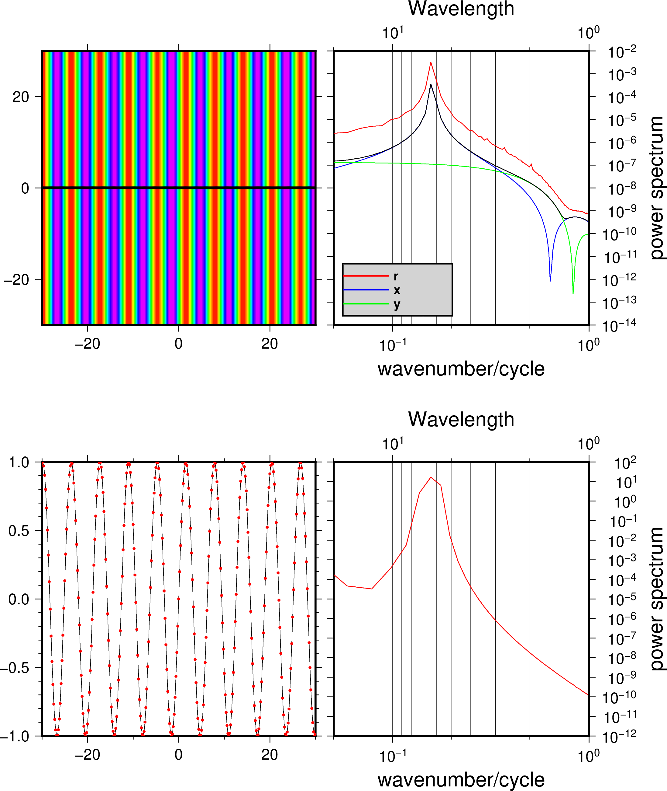
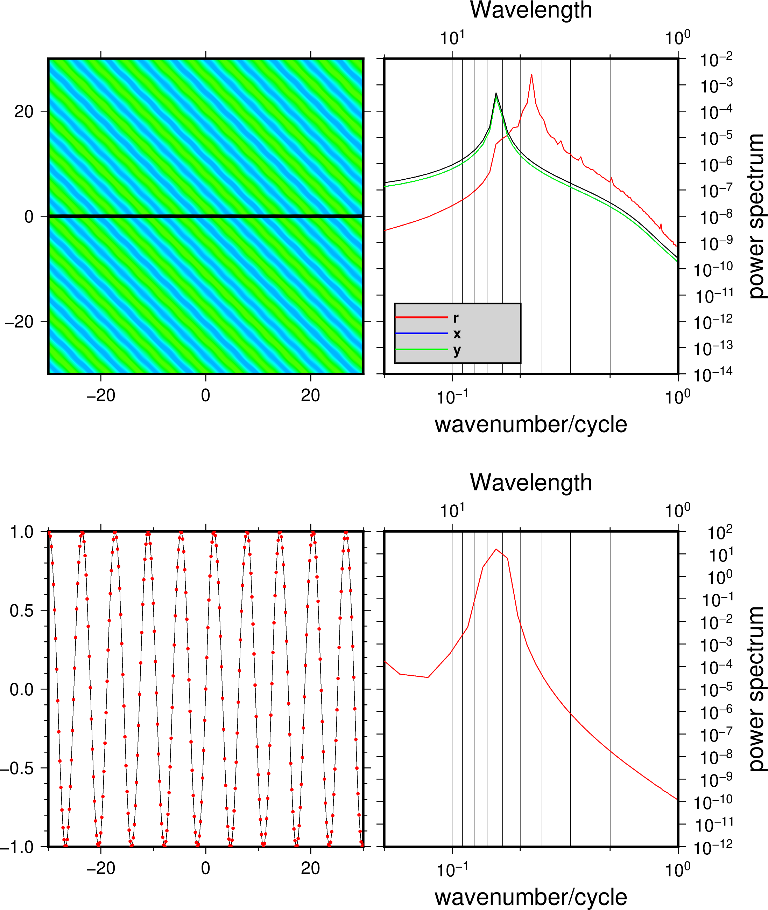

上一篇使用了MATLAB模拟二维波动网格，使用GMT做谱分析和绘图。本文进一步简化模拟代码，仅使用GMT一种语言可完成波数谱的模拟，并展示一维和二维波数谱的差异。

## GMT有几种计算波数谱的程序
GMT有spectrum1D和grdfft可以计算波数谱。

- spectrum1D:一维谱分析。
- grdfft:二维谱分析，含x,y和径向三个方向的计算。

## 模拟代码
下面利用完全GMT工具进行波数谱的模拟，首先利用grdmath模拟出一个规范的正弦波二维矩阵，形成网格文件。然后使用grdfft计算三个方向的谱，使用spectrum1D计算X方向的一维波数谱。

```
#!/usr/bin/env bash
ps=testgrd.ps

# gmt grdmath -R-50/50/-50/50 -I0.2 X Y ADD SIN = x.nc
gmt grdmath -R-50/50/-50/50 -I0.2 X SIN = x.nc

gmt makecpt -Crainbow -T-1/1/0.1 > t.cpt
gmt grdimage x.nc -R-30/30/-30/30 -JX3i -Ct.cpt -Bxa -Bya -BWSne -P -K -Y7i > $ps

gmt grd2xyz x.nc | awk '{if ($2 == 0) print $0}' > x.txt
gmt psxy -R -J -O -K x.txt -Sc0.03i -Gblack >> $ps
# Do grdfft
gmt grdfft x.nc -Er+w+n -Gfft.txt
gmt grdfft x.nc -Ex+w+n -Gfftx.txt
gmt grdfft x.nc -Ey+w+n -Gffty.txt
gmt math fftx.txt -C1 SQR ffty.txt SQR ADD SQRT = fftrr.txt

# Plot specrum result from grdfft
gmt psbasemap -R1/20/1e-14/1e-2 -JX-2.8il/3il -Bxa1pf2g3+l"Wavelength" -Bya1pg+l"power spectrum" -BwNsE -K -X3.2i -O >> $ps
gmt psxy -R fft.txt  -J -W0.5p,red, -O -K >> $ps
gmt psxy -R fftx.txt  -J -W0.5p,blue, -O -K >> $ps
gmt psxy -R ffty.txt  -J -W0.5p,green, -O -K >> $ps
gmt psxy -R fftrr.txt  -J -W0.5p,black, -O -K >> $ps

gmt psbasemap -R0.05/1e0/1e-14/1e-2 -JX2.8il/3il -BSE -Bxa1p+l"wavenumber/cycle" -O -K>> $ps

gmt pslegend -D+w1.2i+jBL+o0.1i/0.1i -R -J -O -K -F+p1p+glightgray --FONT_ANNOT_PRIMARY=10p,1,black << EOF >> $ps
S 0.2i - 0.5i - 1p,red, 0.5i r
S 0.2i - 0.5i - 1p,blue 0.5i x
S 0.2i - 0.5i - 1p,green, 0.5i y
EOF

# Do spectrum1D
gmt psxy -R-30/30/-1/1 -JX3i/3i x.txt -i0,2 -Bxaf -Byaf -BWSne -O -K -X-3.2i -Y-4.5i >> $ps
gmt psxy -R -J x.txt -i0,2 -Sc0.03i -Gred -O -K >> $ps

awk '{print $1,$3}' x.txt | gmt spectrum1d  -S256 -W --GMT_FFT=brenner -N -i1 -D0.2  > fft_spec.txt
gmt psbasemap -R1/20/1e-12/1e2 -JX-2.8il/3il -Bxa1pf2g3+l"Wavelength" -Bya1pg+l"power spectrum" -BwNsE -K -X3.2i -O >> $ps
gmt psxy -R fft_spec.txt -J -W0.5p,red, -O -K >> $ps
gmt psbasemap -R0.05/1e0/1e-12/1e2 -JX2.8il/3il -BSE -Bxa1p+l"wavenumber/cycle" -O >> $ps

awk '{print $3}' x.txt| gmt gmtmath STDIN -Sl STD  SQR =

gmt psconvert  $ps -P -Tg -A
```

## 结果 

### z=sin(x)


上为二维FFT在三个方向的谱分析结果，黑色曲线为sqrt(x^2+y^2),径向的能量谱不与一维的平方和（开根号）相等。下为一维（彩图中横线的采样）谱分析结果（形状与二维FFT的X方向一致，但能量大小不一样）。

### z=sin(x+y)



上图把函数改变，数据x和y方向周期依然是2pi,但是r方向是2pi*cos(pi/2)，即4.44。这样可以帮助理解r方向是什么方向。运行时，把下面的代码取消注释。
```
# gmt grdmath -R-50/50/-50/50 -I0.2 X Y ADD SIN = x.nc
```

## 注意的问题
- spectrum1D得到的波数谱符合能量守恒定律，即输入信号的方差等于功率谱密度的积分，也就是谱和X轴围起来的面积。例如正弦波的方差为0.5，而功率密度的积分也恰好为0.5。
- grdfft得到的波数谱不是密度谱，所以不遵循能量守恒。
- grdfft的三个方向的谱的关系是什么？r^2=x^2+y^2？

## 参考
[wavenumber的模拟计算](https://yangleir.github.io/2020/02/15/wavenumber/)

### 原文链接

原文转载自作者公众号

