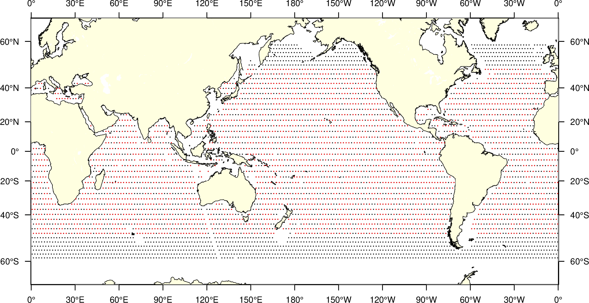

`GMT`是绘图工具，也是数据分析工具，经过几十年的维护，计算和绘图功能都已经相对成熟。今天分享一个使用GMT进行卫星高度计交叉分析的例子，交叉点分析是卫星测高领域常用的数据质量检核手段，历史文献表明大部分的交叉点基于复杂的轨道理论，计算速度缓慢，GMT的`x2sys`采用了几何图形理论，计算速度快，精度高。小编已经将这个功能纳入了卫星测高`GAT`开源程序（尚在完善中）。

全套程序将用到：

- `awk`预处理HY-2B数据，主要是去重和排序。
- x2sys程序包计算交叉点
- GMT绘图展示交叉点位置
- 计算不符值均值和标准差


## code
```
#!/usr/bin/env bash

export X2SYS_HOME=.
gmt set TIME_UNIT s

gmt gmtset FORMAT_DATE_OUT jjj
gmt gmtset MAP_FRAME_WIDTH = 0.02c FORMAT_GEO_MAP = dddF
gmt gmtset FONT_ANNOT_PRIMARY	= 7p
gmt gmtset FONT_LABEL 7 MAP_LABEL_OFFSET 5p

# 去重，HY-2数据中有重复的位置。和数据制作有关系.sort 按照时间先后排列，规范数据格式。筛选出半球数据。分别计算交叉点。

awk '!a[$3]++' hy2b.txt | sort -k 3  | gmt gmtselect  -R0/360/-60/0 >order.dat

# gmt info order.dat

# 初始化x2sys，可以仅运行一次。
gmt x2sys_init CROSSHY2 -Dxys -Edat -V -I1  -G -Ndk -Wd100 -F 
# 计算文件的自交叉点，-Qi
gmt x2sys_cross -TCROSSHY2  order.dat  -Qi -W2 -R  > outs.txt

# 北半球的交叉点计算
awk '!a[$3]++' hy2b.txt | sort -k 3  | gmt gmtselect  -R0/360/0/60 >order2.dat
gmt x2sys_cross -TCROSSHY2  -Qi -W2 -R order2.dat > outn.txt
# make plot
gmt psbasemap -R0/360/-60/60 -JM6i -P -K -Bx30 -By20 > crossover.ps
gmt pscoast -R -J -K -W1/0.25p -Dl -Glightyellow -P -A1000 -O >> crossover.ps
gmt psxy -R -J -O  order*.dat  -Sc0.01i -Gblack -K >> crossover.ps
gmt psxy -R -J -O  out*.txt  -Sc0.03i -Gred  >> crossover.ps

# make plot
awk ' NR>4 && $11>-259200*3 && $11< 259200*3 && $2>-50 && $2<50 && $13>-0.5 && $13<0.5 {print $1,$2,$13}' outs.txt > ja_t.d
awk ' NR>4 && $11>-259200*3 && $11< 259200*3 && $2>-50 && $2<50  && $13>-0.5 && $13<0.5 {print $1,$2,$13}' outn.txt >> ja_t.d

gmt gmtmath ja_t.d -Sl -Ca MEAN  = 
gmt gmtmath ja_t.d -Sl -Ca STD  = 

gmt psbasemap -R0/360/-67/67 -JM6i -P -K -Bx30 -By20 > distribution.ps
gmt pscoast -R -J -K -W1/0.25p -Dl -Glightyellow -P -A1000 -O >> distribution.ps

gmt psxy -R -J -O  out*.txt  -Sc0.01i -Gblack -K >> distribution.ps
rem plot points with time difference less than distribution days.
gmt psxy -R -J -O  ja_t.d  -Sc0.01i -Gred  >> distribution.ps

gmt psconvert distribution.ps -A -P -Tg
gmt psconvert crossover.ps -A -P -Tg

```

目前的`bug`是：

- 不能一步完成全球计算，需要分为南北半球；
- 具备交叉点平差功能，但不适用于长距离的卫星轨道，因此尚未用它来做交差点平差（未来可能改进）。

## 结果


<center>HY-2B交叉点位置</center>

统计结果：
```
-14.8227094512  -7.66263064551  -0.00662686124578 （均值）
112.386536306   30.5483487997   0.142621439114 （STD，可调整时间阈值）
```
上述统计仅仅采用有限数据，不代表卫星的最终质量分析结果。

## 参考文献

关于HY-2B的分析结果可参考下面文献：

[1] WANG J, XU H, YANG L, 等. Cross-Calibrations of the HY-2B Altimeter Using Jason-3 Satellite during the Period of 2019.4~2020.9[J/OL]. Frontiers in Earth Science, 2021, 9[2021–03–15]. https://www.frontiersin.org/articles/10.3389/feart.2021.647583/abstract. DOI:10.3389/feart.2021.647583.
[2] JIA Y, YANG J, LIN M, 等. Global Assessments of the HY-2B Measurements and Cross-Calibrations with Jason-3: 15[J]. Remote Sensing, 2020, 12(15): 2470. DOI:10.3390/rs12152470.

程序发表的相关文献：
[1] WESSEL P. Tools for analyzing intersecting tracks: The x2sys package[J]. Computers & Geosciences, 2010, 36(3): 348–354.
[2] WESSEL P. XOVER: A cross-over error detector for track data[J]. Computers & Geosciences, 1989, 15(3): 333–346.


## 数据获取

示例数据和代码以在GitHub托管：
https://github.com/GenericAltimetryTools/CalAlti/tree/master/crossover
